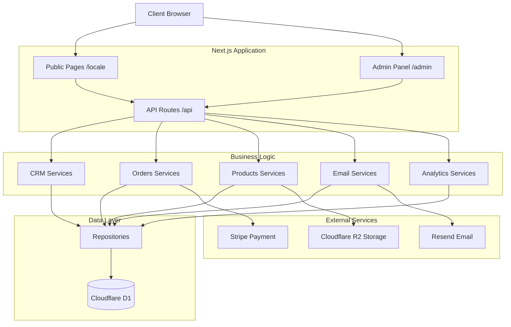
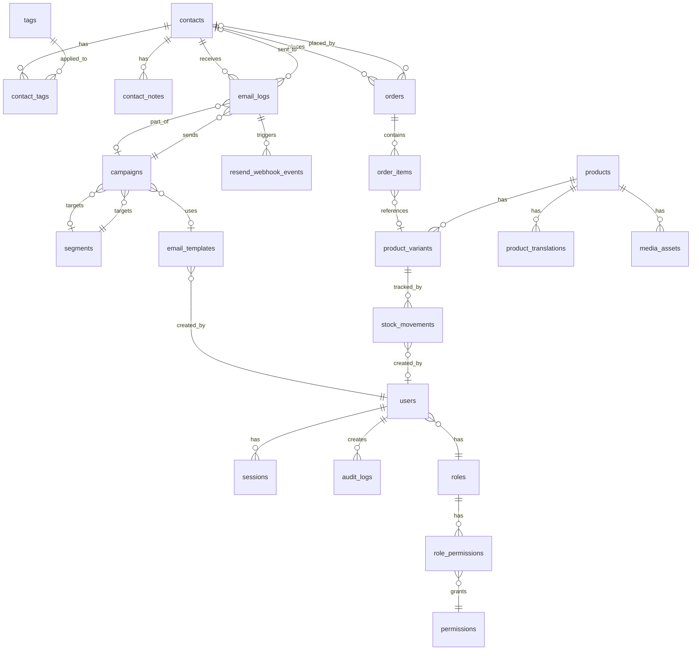

# Design Document — Jubilu System Improvements

## Overview

This comprehensive technical design document details the complete implementation of system improvements for Jubilu, a Next.js platform serving a Christian association dedicated to the Holy Land. The existing system has a functional foundation but requires significant enhancements across architecture, performance, CRM capabilities, email system, design, and multilingual content.

### Primary Objectives

1. **Architectural Refactoring**: Eliminate technical debt, establish consistent patterns, implement clean layered architecture
2. **Performance Optimization**: Achieve Core Web Vitals scores >90, API response times <200ms (p95), optimized database queries
3. **Advanced CRM**: Comprehensive contact management (lead/client/donor) with segmentation, tagging, notes, and complete lifecycle tracking
4. **Email System**: Full-featured email engine with templates, campaigns, tracking, multilingual support, and analytics
5. **Modern Design System**: Premium, consistent, accessible, responsive UI based on brand identity
6. **Multilingual RTL**: Complete fr/en/es/he support with proper RTL layout handling
7. **RBAC & Audit Trail**: Granular role-based permissions, comprehensive audit logging
8. **Analytics Dashboard**: Real-time business metrics, conversion funnels, geographic insights
9. **Security Hardening**: Complete security implementation, GDPR compliance, rate limiting, CSRF protection

### Design Scope

This design addresses 20 requirements organized into 9 major domains:
- **Architecture & Performance** (Requirements 1-2)
- **Feature Development** (Requirements 3, 12-13)
- **Multilingual & Content** (Requirements 4-5)
- **Design System** (Requirement 6)
- **Enhanced CRM** (Requirements 7-8, 11)
- **Email System** (Requirements 9-10)
- **Dashboard Analytics** (Requirement 14)
- **Security & Compliance** (Requirements 15-16)
- **DevOps & Documentation** (Requirements 17-20)

### Technology Stack

- **Framework**: Next.js 14 (App Router) on Cloudflare Pages
- **Database**: Cloudflare D1 (SQLite) via Drizzle ORM
- **Styling**: Tailwind CSS + shadcn/ui + Framer Motion
- **i18n**: next-intl with RTL support
- **Email**: Resend
- **Payments**: Stripe
- **Storage**: Cloudflare R2
- **Testing**: Vitest + Testing Library
- **Type Safety**: TypeScript + Zod for runtime validation

## Architecture

### Architectural Principles

1. **Separation of Concerns**: Strict decoupling between presentation, business logic, and data access layers
2. **Domain-Driven Design**: Organization by business domains (CRM, Orders, Products, Campaigns, Analytics)
3. **Type Safety**: Strong typing with TypeScript + Zod for runtime validation
4. **Edge-First**: Optimization for Cloudflare Workers edge runtime environment
5. **Progressive Enhancement**: Core functionality works without JavaScript, enhanced with JS
6. **API-First**: RESTful API design with consistent response formats and error handling
7. **Security by Default**: Authentication, authorization, and input validation at every layer

### High-Level Architecture Diagram



### Project Directory Structure

```
jubilu/
├── src/
│   ├── app/                                # Next.js App Router
│   │   ├── [locale]/                      # Public i18n routes
│   │   │   ├── layout.tsx                # Root layout with locale provider
│   │   │   ├── page.tsx                  # Homepage
│   │   │   ├── boutique/                 # Product catalog
│   │   │   │   ├── page.tsx             # Product listing
│   │   │   │   └── [slug]/              # Product detail pages
│   │   │   ├── mission/                  # Mission pages
│   │   │   ├── actualites/               # Blog posts
│   │   │   ├── a-propos/                 # About page
│   │   │   ├── contact/                  # Contact form
│   │   │   └── compte/                   # Customer account area
│   │   │       ├── profil/
│   │   │       ├── commandes/
│   │   │       └── parametres/
│   │   ├── admin/                         # Admin panel
│   │   │   ├── (dash)/                   # Protected admin routes
│   │   │   │   ├── layout.tsx           # Dashboard layout with sidebar
│   │   │   │   ├── page.tsx             # Dashboard overview
│   │   │   │   ├── crm/                 # CRM management
│   │   │   │   │   ├── page.tsx        # Contacts list
│   │   │   │   │   ├── [id]/           # Contact detail
│   │   │   │   │   ├── segments/       # Segment builder
│   │   │   │   │   └── tags/           # Tag management
│   │   │   │   ├── commandes/           # Order management
│   │   │   │   │   ├── page.tsx
│   │   │   │   │   └── [id]/
│   │   │   │   ├── produits/            # Product management
│   │   │   │   │   ├── page.tsx
│   │   │   │   │   ├── nouveau/
│   │   │   │   │   └── [id]/
│   │   │   │   ├── stock/               # Stock tracking
│   │   │   │   ├── campagnes/           # Email campaigns
│   │   │   │   │   ├── page.tsx
│   │   │   │   │   ├── nouvelle/
│   │   │   │   │   └── [id]/
│   │   │   │   ├── templates/           # Email templates
│   │   │   │   ├── analytics/           # Analytics dashboard
│   │   │   │   ├── parametres/          # Settings
│   │   │   │   │   ├── general/
│   │   │   │   │   ├── roles/          # RBAC management
│   │   │   │   │   ├── utilisateurs/
│   │   │   │   │   └── api-keys/
│   │   │   │   └── audit/              # Audit logs
│   │   │   └── login/                   # Admin login
│   │   ├── api/                          # API Routes
│   │   │   ├── admin/                   # Admin API endpoints
│   │   │   │   ├── contacts/
│   │   │   │   │   ├── route.ts         # GET, POST /api/admin/contacts
│   │   │   │   │   ├── [id]/
│   │   │   │   │   │   ├── route.ts     # GET, PATCH, DELETE
│   │   │   │   │   │   ├── tags/
│   │   │   │   │   │   └── notes/
│   │   │   │   │   ├── import/
│   │   │   │   │   ├── export/
│   │   │   │   │   ├── merge/
│   │   │   │   │   └── search/
│   │   │   │   ├── segments/
│   │   │   │   ├── campaigns/
│   │   │   │   ├── templates/
│   │   │   │   ├── orders/
│   │   │   │   ├── products/
│   │   │   │   ├── dashboard/
│   │   │   │   ├── settings/
│   │   │   │   └── audit/
│   │   │   ├── client/                  # Client-facing API
│   │   │   │   ├── account/
│   │   │   │   └── orders/
│   │   │   ├── contact/                 # Public contact form
│   │   │   ├── newsletter/              # Newsletter signup
│   │   │   └── webhook/                 # External webhooks
│   │   │       ├── stripe/
│   │   │       └── resend/
│   │   ├── globals.css                  # Global styles
│   │   └── sitemap.ts                   # Dynamic sitemap generation
│   ├── lib/                              # Business logic & utilities
│   │   ├── domains/                     # Domain services (business logic)
│   │   │   ├── crm/
│   │   │   │   ├── contacts.service.ts
│   │   │   │   ├── segments.service.ts
│   │   │   │   ├── tags.service.ts
│   │   │   │   └── notes.service.ts
│   │   │   ├── orders/
│   │   │   │   ├── orders.service.ts
│   │   │   │   ├── fulfillment.service.ts
│   │   │   │   └── production.service.ts
│   │   │   ├── products/
│   │   │   │   ├── products.service.ts
│   │   │   │   ├── variants.service.ts
│   │   │   │   └── media.service.ts
│   │   │   ├── campaigns/
│   │   │   │   ├── campaigns.service.ts
│   │   │   │   ├── templates.service.ts
│   │   │   │   └── webhooks.service.ts
│   │   │   └── analytics/
│   │   │       └── dashboard.service.ts
│   │   ├── repositories/                 # Data access layer
│   │   │   ├── contacts.repository.ts
│   │   │   ├── segments.repository.ts
│   │   │   ├── orders.repository.ts
│   │   │   ├── products.repository.ts
│   │   │   ├── campaigns.repository.ts
│   │   │   ├── templates.repository.ts
│   │   │   └── audit.repository.ts
│   │   ├── utils/                        # Utility functions
│   │   │   ├── validation.ts            # Zod schemas
│   │   │   ├── formatting.ts            # Date, currency, number formatting
│   │   │   ├── dates.ts                 # Date utilities
│   │   │   ├── result.ts                # Result type for error handling
│   │   │   └── security.ts              # Security utilities
│   │   ├── auth.ts                       # Authentication logic
│   │   ├── email.ts                      # Email service wrapper
│   │   ├── db.ts                         # Database client
│   │   └── middleware/                   # Middleware functions
│   │       ├── auth.middleware.ts
│   │       ├── rbac.middleware.ts
│   │       └── rate-limit.middleware.ts
│   ├── components/                       # React components
│   │   ├── ui/                          # Base shadcn/ui components
│   │   │   ├── button.tsx
│   │   │   ├── input.tsx
│   │   │   ├── card.tsx
│   │   │   ├── dialog.tsx
│   │   │   ├── table.tsx
│   │   │   ├── badge.tsx
│   │   │   └── ...
│   │   ├── admin/                       # Admin-specific components
│   │   │   ├── sidebar.tsx
│   │   │   ├── header.tsx
│   │   │   ├── crm/
│   │   │   │   ├── contacts-table.tsx
│   │   │   │   ├── contact-detail.tsx
│   │   │   │   ├── segment-builder.tsx
│   │   │   │   └── tag-manager.tsx
│   │   │   ├── campaigns/
│   │   │   │   ├── campaign-list.tsx
│   │   │   │   ├── campaign-form.tsx
│   │   │   │   ├── template-editor.tsx
│   │   │   │   └── stats-card.tsx
│   │   │   ├── orders/
│   │   │   │   ├── orders-table.tsx
│   │   │   │   ├── order-detail.tsx
│   │   │   │   └── production-tracker.tsx
│   │   │   └── dashboard/
│   │   │       ├── metric-card.tsx
│   │   │       ├── revenue-chart.tsx
│   │   │       ├── orders-chart.tsx
│   │   │       └── activity-feed.tsx
│   │   ├── public/                      # Public site components
│   │   │   ├── header.tsx
│   │   │   ├── footer.tsx
│   │   │   ├── product-card.tsx
│   │   │   ├── product-gallery.tsx
│   │   │   └── hero-section.tsx
│   │   └── shared/                      # Shared components
│   │       ├── data-table.tsx           # Generic reusable table
│   │       ├── form-builder.tsx         # Form abstraction
│   │       ├── locale-switcher.tsx      # Language selector
│   │       ├── rtl-provider.tsx         # RTL layout provider
│   │       └── search-input.tsx
│   └── types/                            # TypeScript type definitions
│       ├── api.ts                       # API request/response types
│       ├── domain.ts                    # Domain model types
│       └── database.ts                  # Database types
├── db/                                   # Database schema & migrations
│   ├── schema.ts                        # Drizzle ORM schema
│   ├── migrations/                      # Migration files
│   │   └── 0000_*.sql
│   └── seed.ts                          # Database seeding script
├── messages/                             # i18n translation files
│   ├── fr.json                          # French translations
│   ├── en.json                          # English translations
│   ├── es.json                          # Spanish translations
│   └── he.json                          # Hebrew translations
├── public/                               # Static assets
│   └── images/
├── tests/                                # Test files
│   ├── unit/
│   ├── integration/
│   └── e2e/
├── .env.example                         # Environment variables template
├── .eslintrc.json                       # ESLint configuration
├── next.config.mjs                      # Next.js configuration
├── tailwind.config.ts                   # Tailwind CSS configuration
├── drizzle.config.ts                    # Drizzle ORM configuration
├── tsconfig.json                        # TypeScript configuration
├── vitest.config.ts                     # Vitest configuration
└── package.json

```

### Layered Architecture


#### 1. Presentation Layer (Components + Pages)

**Responsabilités** :
- Rendering UI
- Handling user interactions
- Form state management
- Client-side validation
- Routing navigation

**Patterns** :
- Server Components par défaut pour SEO et performance
- Client Components (`"use client"`) uniquement pour interactivité
- Composition de composants atomiques (shadcn/ui)
- Props drilling évité via React Context quand nécessaire

**Exemple** :
```typescript
// app/admin/(dash)/crm/page.tsx
import { ContactsTable } from '@/components/admin/crm/contacts-table';
import { contactsService } from '@/lib/domains/crm/contacts.service';

export default async function CrmPage() {
  const contacts = await contactsService.getAll();
  
  return (
    <div className="space-y-6">
      <h1>Gestion CRM</h1>
      <ContactsTable contacts={contacts} />
    </div>
  );
}
```

#### 2. Business Logic Layer (Services)

**Responsabilités** :
- Business rules implementation
- Domain logic orchestration
- Transaction coordination
- Cross-repository operations
- Business validation

**Patterns** :
- Un service par domaine métier
- Méthodes nommées selon l'intention métier
- Retourne des types de domaine, pas des types DB
- Gère les transactions multi-repository

**Exemple** :
```typescript
// lib/domains/crm/contacts.service.ts
import { contactsRepository } from '@/lib/repositories/contacts.repository';
import { ordersRepository } from '@/lib/repositories/orders.repository';
import type { Contact, ContactStatus } from '@/types/domain';

export const contactsService = {
  async updateStatusBasedOnOrders(contactId: string): Promise<void> {
    const orderCount = await ordersRepository.countByContact(contactId);
    const newStatus: ContactStatus = orderCount > 0 ? 'client' : 'lead';
    
    await contactsRepository.updateStatus(contactId, newStatus);
  },

  async calculateLifetimeValue(contactId: string): Promise<number> {
    return await ordersRepository.sumTotalByContact(contactId);
  }
};
```

#### 3. Data Access Layer (Repositories)

**Responsabilités** :
- Database queries
- ORM operations
- Query optimization
- Data mapping DB ↔ Domain

**Patterns** :
- Un repository par entité/aggregate
- Méthodes CRUD + requêtes métier spécifiques
- Retourne des types de domaine, pas des types Drizzle bruts
- Gère les indexes et optimisations

**Exemple** :
```typescript
// lib/repositories/contacts.repository.ts
import { db } from '@/lib/db';
import { contacts, orders } from '@/db/schema';
import { eq, sql } from 'drizzle-orm';
import type { Contact } from '@/types/domain';

export const contactsRepository = {
  async findById(id: string): Promise<Contact | null> {
    const rows = await db
      .select()
      .from(contacts)
      .where(eq(contacts.id, id))
      .limit(1);
    
    return rows[0] ? mapToContact(rows[0]) : null;
  },

  async updateTotalSpent(contactId: string): Promise<void> {
    const result = await db
      .select({ total: sql<number>`SUM(${orders.total})` })
      .from(orders)
      .where(eq(orders.contactId, contactId));
    
    await db
      .update(contacts)
      .set({ totalSpent: result[0]?.total ?? 0 })
      .where(eq(contacts.id, contactId));
  }
};
```

### Refactoring Architectural Patterns


#### Error Handling Pattern

**Pattern Unifié** : Result Type avec Either monad

```typescript
// lib/utils/result.ts
export type Result<T, E = Error> =
  | { ok: true; value: T }
  | { ok: false; error: E };

export function ok<T>(value: T): Result<T, never> {
  return { ok: true, value };
}

export function err<E>(error: E): Result<never, E> {
  return { ok: false, error };
}

// Usage dans service
export const contactsService = {
  async create(data: CreateContactInput): Promise<Result<Contact, ValidationError>> {
    const validation = validateContactInput(data);
    if (!validation.success) {
      return err(new ValidationError(validation.errors));
    }

    try {
      const contact = await contactsRepository.create(data);
      return ok(contact);
    } catch (e) {
      if (e instanceof UniqueConstraintError) {
        return err(new ValidationError({ email: 'Email already exists' }));
      }
      throw e; // Unexpected errors thrown
    }
  }
};

// Usage dans API route
export async function POST(request: Request) {
  const body = await request.json();
  const result = await contactsService.create(body);

  if (!result.ok) {
    return Response.json({ error: result.error.message }, { status: 400 });
  }

  return Response.json(result.value, { status: 201 });
}
```

#### Type Safety Pattern

**Zod pour validation runtime + inférence types** :

```typescript
// lib/utils/validation.ts
import { z } from 'zod';

export const contactSchema = z.object({
  firstName: z.string().min(1).max(100).optional(),
  lastName: z.string().min(1).max(100).optional(),
  email: z.string().email().max(255),
  phone: z.string().max(50).optional(),
  country: z.string().length(2).optional(), // ISO code
  locale: z.enum(['fr', 'en', 'es', 'he']),
  status: z.enum(['lead', 'client', 'donateur']),
  emailConsent: z.boolean().default(false),
});

export type ContactInput = z.infer<typeof contactSchema>;

// Usage dans API route
export async function POST(request: Request) {
  const body = await request.json();
  const parsed = contactSchema.safeParse(body);

  if (!parsed.success) {
    return Response.json({ errors: parsed.error.flatten() }, { status: 400 });
  }

  const contact = await contactsService.create(parsed.data);
  return Response.json(contact, { status: 201 });
}
```

### Code Consolidation

**Patterns de réutilisation** :

1. **Data Table générique** pour toutes les listes admin
2. **Form builders** avec validation intégrée
3. **Query hooks** pour fetching patterns communs
4. **Formatters utilitaires** (dates, montants, locales)

```typescript
// components/shared/data-table.tsx - Générique réutilisable
interface DataTableProps<T> {
  columns: ColumnDef<T>[];
  data: T[];
  searchKey?: keyof T;
  onRowClick?: (row: T) => void;
}

export function DataTable<T>({ columns, data, searchKey, onRowClick }: DataTableProps<T>) {
  // ... implémentation TanStack Table
}

// Usage dans ContactsTable
const columns: ColumnDef<Contact>[] = [
  { accessorKey: 'email', header: 'Email' },
  { accessorKey: 'status', header: 'Statut' },
  // ...
];

<DataTable columns={columns} data={contacts} searchKey="email" />
```

## Components and Interfaces

### Core Domain Interfaces


#### CRM Domain

```typescript
// types/domain.ts

export type ContactStatus = 'lead' | 'client' | 'donateur';
export type ContactSource = 'website' | 'import' | 'manual' | 'checkout' | 'campaign';

export interface Contact {
  id: string;
  firstName?: string;
  lastName?: string;
  email: string;
  phone?: string;
  country?: string;
  locale: Locale;
  status: ContactStatus;
  source?: ContactSource;
  emailConsent: boolean;
  ordersCount: number;
  totalSpent: number; // en centimes
  createdAt: Date;
  tags?: Tag[];
  notes?: ContactNote[];
}

export interface Tag {
  id: string;
  name: string;
  color?: string;
}

export interface ContactNote {
  id: string;
  contactId: string;
  authorId?: string;
  authorName?: string;
  body: string;
  createdAt: Date;
}

export interface Segment {
  id: string;
  name: string;
  definition: SegmentDefinition;
  memberCount?: number;
}

export interface SegmentDefinition {
  filters: SegmentFilter[];
  operator: 'AND' | 'OR';
}

export interface SegmentFilter {
  field: 'status' | 'country' | 'locale' | 'tags' | 'totalSpent' | 'ordersCount' | 'lastOrderDate';
  operator: 'eq' | 'ne' | 'gt' | 'gte' | 'lt' | 'lte' | 'in' | 'notIn' | 'contains';
  value: string | number | string[] | number[];
}
```

#### Orders Domain

```typescript
export type OrderStatus = 
  | 'pending' 
  | 'paid' 
  | 'prepared' 
  | 'shipped' 
  | 'delivered' 
  | 'cancelled' 
  | 'refunded';

export type ProductionStatus = 
  | 'to_produce' 
  | 'in_production' 
  | 'quality_check' 
  | 'ready' 
  | 'shipped';

export interface Order {
  id: string;
  number: string;
  contactId?: string;
  status: OrderStatus;
  subtotal: number;
  shipping: number;
  tax: number;
  total: number;
  currency: string;
  locale: Locale;
  shippingAddress?: Address;
  items: OrderItem[];
  stripeSessionId?: string;
  createdAt: Date;
}

export interface OrderItem {
  id: string;
  orderId: string;
  variantId?: string;
  nameSnapshot: string;
  unitPrice: number;
  qty: number;
  customText?: string; // Pour parchemins
  productionStatus?: ProductionStatus;
}

export interface Address {
  name: string;
  line1: string;
  line2?: string;
  city: string;
  postalCode: string;
  country: string;
}
```

#### Campaigns Domain

```typescript
export type CampaignStatus = 'draft' | 'scheduled' | 'sending' | 'sent' | 'archived';
export type EmailType = 'transactional' | 'campaign';
export type EmailStatus = 'sent' | 'delivered' | 'opened' | 'clicked' | 'bounced' | 'failed';

export interface Campaign {
  id: string;
  name: string;
  subject: string;
  templateId?: string;
  segmentId?: string;
  status: CampaignStatus;
  locale?: Locale;
  scheduledAt?: Date;
  sentAt?: Date;
  stats?: CampaignStats;
  createdAt: Date;
}

export interface CampaignStats {
  sent: number;
  delivered: number;
  opened: number;
  clicked: number;
  bounced: number;
  unsubscribed: number;
  deliveryRate: number;
  openRate: number;
  clickRate: number;
}

export interface EmailTemplate {
  id: string;
  key: string;
  name: string;
  locale: Locale;
  subject: string;
  html: string;
  variables?: string[]; // Liste des {{variable}} disponibles
  category?: 'transactional' | 'promotional' | 'newsletter';
  updatedAt: Date;
}

export interface EmailLog {
  id: string;
  campaignId?: string;
  contactId?: string;
  type: EmailType;
  resendId?: string;
  status: EmailStatus;
  openedAt?: Date;
  clickedAt?: Date;
  bouncedAt?: Date;
  createdAt: Date;
}
```

#### Products Domain

```typescript
export type ProductCategory = 'wine-white' | 'wine-red' | 'wine-rose' | 'parchments';
export type ProductStatus = 'active' | 'draft' | 'archived';

export interface Product {
  id: string;
  slug: string;
  category: ProductCategory;
  status: ProductStatus;
  featured: boolean;
  customizable: boolean;
  basePrice: number;
  currency: string;
  translations: Record<Locale, ProductTranslation>;
  variants: ProductVariant[];
  media: MediaAsset[];
  createdAt: Date;
}

export interface ProductTranslation {
  name: string;
  shortDesc?: string;
  longDesc?: string;
}

export interface ProductVariant {
  id: string;
  productId: string;
  sku: string;
  name?: string;
  price: number;
  stock: number;
  active: boolean;
}

export interface MediaAsset {
  id: string;
  productId?: string;
  url: string;
  alt?: string;
  position: number;
}
```

### Service Interfaces


#### CRM Service Interface

```typescript
// lib/domains/crm/contacts.service.ts
export interface ContactsService {
  // CRUD
  getAll(filters?: ContactFilters): Promise<Contact[]>;
  getById(id: string): Promise<Contact | null>;
  create(input: CreateContactInput): Promise<Result<Contact>>;
  update(id: string, input: UpdateContactInput): Promise<Result<Contact>>;
  delete(id: string): Promise<Result<void>>;
  
  // Business logic
  updateStatusBasedOnOrders(contactId: string): Promise<void>;
  calculateLifetimeValue(contactId: string): Promise<number>;
  merge(sourceId: string, targetId: string): Promise<Result<Contact>>;
  
  // Tags
  addTag(contactId: string, tagId: string): Promise<void>;
  removeTag(contactId: string, tagId: string): Promise<void>;
  
  // Notes
  addNote(contactId: string, input: CreateNoteInput): Promise<ContactNote>;
  
  // Import/Export
  importFromCsv(file: File): Promise<ImportResult>;
  exportToCsv(filters?: ContactFilters): Promise<Blob>;
  
  // Search
  search(query: string): Promise<Contact[]>;
}

export interface SegmentsService {
  getAll(): Promise<Segment[]>;
  getById(id: string): Promise<Segment | null>;
  create(input: CreateSegmentInput): Promise<Segment>;
  update(id: string, input: UpdateSegmentInput): Promise<Segment>;
  delete(id: string): Promise<void>;
  
  // Members
  getMembers(segmentId: string): Promise<Contact[]>;
  countMembers(segmentId: string): Promise<number>;
  evaluateFilters(definition: SegmentDefinition): Promise<string[]>; // Returns contact IDs
}
```

#### Campaigns Service Interface

```typescript
// lib/domains/campaigns/campaigns.service.ts
export interface CampaignsService {
  // CRUD
  getAll(): Promise<Campaign[]>;
  getById(id: string): Promise<Campaign | null>;
  create(input: CreateCampaignInput): Promise<Campaign>;
  update(id: string, input: UpdateCampaignInput): Promise<Campaign>;
  delete(id: string): Promise<void>;
  duplicate(id: string): Promise<Campaign>;
  
  // Execution
  send(id: string): Promise<Result<void>>;
  schedule(id: string, scheduledAt: Date): Promise<void>;
  sendTest(id: string, emails: string[]): Promise<Result<void>>;
  
  // Stats
  getStats(id: string): Promise<CampaignStats>;
  refreshStats(id: string): Promise<CampaignStats>;
  
  // Webhooks
  handleDelivered(resendId: string): Promise<void>;
  handleOpened(resendId: string): Promise<void>;
  handleClicked(resendId: string): Promise<void>;
  handleBounced(resendId: string): Promise<void>;
}

export interface TemplatesService {
  getAll(locale?: Locale): Promise<EmailTemplate[]>;
  getById(id: string): Promise<EmailTemplate | null>;
  getByKey(key: string, locale: Locale): Promise<EmailTemplate | null>;
  create(input: CreateTemplateInput): Promise<EmailTemplate>;
  update(id: string, input: UpdateTemplateInput): Promise<EmailTemplate>;
  delete(id: string): Promise<void>;
  
  // Rendering
  render(templateId: string, variables: Record<string, string>): Promise<string>;
  validateTemplate(html: string): Promise<ValidationResult>;
  extractVariables(html: string): string[];
  
  // Preview
  previewInClients(html: string): Promise<PreviewUrls>;
}
```

#### Analytics Service Interface

```typescript
// lib/domains/analytics/dashboard.service.ts
export interface DashboardService {
  getOverview(dateRange: DateRange): Promise<DashboardOverview>;
  getRevenueMetrics(dateRange: DateRange): Promise<RevenueMetrics>;
  getOrdersMetrics(dateRange: DateRange): Promise<OrdersMetrics>;
  getContactsMetrics(dateRange: DateRange): Promise<ContactsMetrics>;
  getCampaignsMetrics(dateRange: DateRange): Promise<CampaignsMetrics>;
  getTopProducts(dateRange: DateRange, limit: number): Promise<TopProduct[]>;
  getRevenueByCategory(dateRange: DateRange): Promise<CategoryRevenue[]>;
  getCustomerAcquisition(dateRange: DateRange): Promise<AcquisitionMetrics>;
  getConversionFunnel(dateRange: DateRange): Promise<FunnelMetrics>;
  getGeographicDistribution(dateRange: DateRange): Promise<GeoDistribution[]>;
  getRecentActivity(limit: number): Promise<Activity[]>;
}

export interface DashboardOverview {
  totalRevenue: number;
  revenueChange: number; // percentage vs previous period
  totalOrders: number;
  ordersChange: number;
  newContacts: number;
  contactsChange: number;
  avgCartValue: number;
  avgCartChange: number;
}
```

### API Routes Structure


#### Admin API Routes

```
/api/admin/
├── contacts/
│   ├── GET     - List all contacts with filters
│   ├── POST    - Create new contact
│   ├── [id]/
│   │   ├── GET    - Get contact details
│   │   ├── PATCH  - Update contact
│   │   ├── DELETE - Delete contact
│   │   ├── tags/
│   │   │   ├── POST   - Add tag to contact
│   │   │   └── DELETE - Remove tag from contact
│   │   └── notes/
│   │       └── POST   - Add note to contact
│   ├── import/
│   │   └── POST   - Import contacts from CSV
│   ├── export/
│   │   └── GET    - Export contacts to CSV
│   ├── merge/
│   │   └── POST   - Merge two contacts
│   └── search/
│       └── GET    - Search contacts
├── segments/
│   ├── GET     - List all segments
│   ├── POST    - Create segment
│   ├── [id]/
│   │   ├── GET    - Get segment details
│   │   ├── PATCH  - Update segment
│   │   ├── DELETE - Delete segment
│   │   └── members/
│   │       └── GET - Get segment members
│   └── evaluate/
│       └── POST   - Evaluate segment filters (preview)
├── campaigns/
│   ├── GET     - List all campaigns
│   ├── POST    - Create campaign
│   ├── [id]/
│   │   ├── GET    - Get campaign details
│   │   ├── PATCH  - Update campaign
│   │   ├── DELETE - Delete campaign
│   │   ├── send/
│   │   │   └── POST   - Send campaign now
│   │   ├── schedule/
│   │   │   └── POST   - Schedule campaign
│   │   ├── test/
│   │   │   └── POST   - Send test emails
│   │   ├── duplicate/
│   │   │   └── POST   - Duplicate campaign
│   │   └── stats/
│   │       └── GET    - Get campaign stats
├── templates/
│   ├── GET     - List all templates
│   ├── POST    - Create template
│   ├── [id]/
│   │   ├── GET    - Get template
│   │   ├── PATCH  - Update template
│   │   ├── DELETE - Delete template
│   │   ├── preview/
│   │   │   └── POST   - Preview with data
│   │   └── validate/
│   │       └── POST   - Validate HTML
├── orders/
│   ├── GET     - List orders with filters
│   ├── [id]/
│   │   ├── GET    - Get order details
│   │   ├── PATCH  - Update order status
│   │   ├── cancel/
│   │   │   └── POST   - Cancel order
│   │   ├── refund/
│   │   │   └── POST   - Process refund
│   │   └── notes/
│   │       └── POST   - Add internal note
│   └── export/
│       └── GET    - Export orders to CSV
├── products/
│   ├── GET     - List products
│   ├── POST    - Create product
│   ├── [id]/
│   │   ├── GET    - Get product
│   │   ├── PATCH  - Update product
│   │   ├── DELETE - Delete product
│   │   ├── variants/
│   │   │   ├── POST   - Add variant
│   │   │   └── [variantId]/
│   │   │       ├── PATCH  - Update variant
│   │   │       └── DELETE - Delete variant
│   │   └── media/
│   │       ├── POST   - Upload image
│   │       └── [mediaId]/
│   │           └── DELETE - Delete image
├── dashboard/
│   ├── overview/
│   │   └── GET    - Dashboard overview
│   ├── revenue/
│   │   └── GET    - Revenue metrics
│   ├── top-products/
│   │   └── GET    - Top selling products
│   └── activity/
│       └── GET    - Recent activity feed
├── settings/
│   ├── GET     - Get all settings
│   ├── PATCH   - Update settings
│   └── roles/
│       └── GET    - Get roles and permissions
└── audit/
    └── GET     - Get audit logs with filters
```

#### Webhook Routes

```
/api/webhook/
├── stripe/
│   └── POST    - Stripe webhook events
├── resend/
│   └── POST    - Resend webhook events (delivery, open, click, bounce)
```

## Data Models


### Database Schema Extensions

Le schéma actuel dans `db/schema.ts` est déjà bien structuré. Les extensions suivantes sont nécessaires :

#### Ajouts aux tables existantes

```typescript
// Extension de la table contacts
export const contacts = sqliteTable('contacts', {
  // ... champs existants
  lastActivityAt: text('last_activity_at'), // Dernière activité (order, email)
  lastOrderAt: text('last_order_at'), // Date dernière commande
  avgCartValue: integer('avg_cart_value').default(0), // Panier moyen en centimes
});

// Ajout d'indexes pour performance
export const contactsEmailIdx = index('contacts_email_idx').on(contacts.email);
export const contactsStatusIdx = index('contacts_status_idx').on(contacts.status);
export const contactsCreatedAtIdx = index('contacts_created_at_idx').on(contacts.createdAt);

// Extension de la table campaigns
export const campaigns = sqliteTable('campaigns', {
  // ... champs existants
  htmlContent: text('html_content'), // Contenu HTML si pas de template
  plainTextContent: text('plain_text_content'), // Version plain text
});

// Ajout d'indexes pour campaigns
export const campaignsStatusIdx = index('campaigns_status_idx').on(campaigns.status);
export const campaignsScheduledAtIdx = index('campaigns_scheduled_at_idx').on(campaigns.scheduledAt);

// Extension de la table orders
export const orders = sqliteTable('orders', {
  // ... champs existants
  fulfilledAt: text('fulfilled_at'), // Date de préparation
  shippedAt: text('shipped_at'), // Date d'expédition
  deliveredAt: text('delivered_at'), // Date de livraison
  trackingNumber: text('tracking_number'), // Numéro de suivi
});

// Ajout d'indexes pour orders
export const ordersContactIdx = index('orders_contact_idx').on(orders.contactId);
export const ordersStatusIdx = index('orders_status_idx').on(orders.status);
export const ordersCreatedAtIdx = index('orders_created_at_idx').on(orders.createdAt);
```

#### Nouvelles tables

```typescript
// Table pour les événements de webhook Resend
export const resendWebhookEvents = sqliteTable('resend_webhook_events', {
  id: text('id').primaryKey(),
  type: text('type').notNull(), // email.delivered, email.opened, etc.
  emailLogId: text('email_log_id').references(() => emailLogs.id),
  payload: text('payload_json').notNull(),
  processedAt: text('processed_at'),
  createdAt: text('created_at').notNull(),
});

// Table pour les sessions utilisateur (sécurité améliorée)
export const sessions = sqliteTable('sessions', {
  id: text('id').primaryKey(),
  userId: text('user_id').notNull().references(() => users.id),
  token: text('token').notNull().unique(),
  ip: text('ip'),
  userAgent: text('user_agent'),
  expiresAt: text('expires_at').notNull(),
  createdAt: text('created_at').notNull(),
});

// Index pour sessions
export const sessionsTokenIdx = index('sessions_token_idx').on(sessions.token);
export const sessionsExpiresAtIdx = index('sessions_expires_at_idx').on(sessions.expiresAt);

// Table pour le rate limiting
export const rateLimits = sqliteTable('rate_limits', {
  id: text('id').primaryKey(),
  identifier: text('identifier').notNull(), // IP ou userId
  action: text('action').notNull(), // login, api_call, etc.
  count: integer('count').notNull().default(0),
  windowStart: text('window_start').notNull(),
  expiresAt: text('expires_at').notNull(),
});

export const rateLimitsIdentifierIdx = index('rate_limits_identifier_idx')
  .on(rateLimits.identifier, rateLimits.action);
```

### Entity Relationships Diagram



### Data Validation Rules


#### Contact Validation

```typescript
// lib/utils/validation.ts
export const createContactSchema = z.object({
  firstName: z.string().min(1).max(100).optional(),
  lastName: z.string().min(1).max(100).optional(),
  email: z.string().email().max(255),
  phone: z.string().max(50).regex(/^[+\d\s()-]+$/).optional(),
  country: z.string().length(2).toUpperCase().optional(),
  locale: z.enum(['fr', 'en', 'es', 'he']).default('fr'),
  status: z.enum(['lead', 'client', 'donateur']).default('lead'),
  source: z.enum(['website', 'import', 'manual', 'checkout', 'campaign']).optional(),
  emailConsent: z.boolean().default(false),
});

export const updateContactSchema = createContactSchema.partial();

export const bulkTagSchema = z.object({
  contactIds: z.array(z.string().uuid()).min(1).max(100),
  tagId: z.string().uuid(),
});
```

#### Segment Validation

```typescript
export const segmentFilterSchema = z.object({
  field: z.enum([
    'status',
    'country',
    'locale',
    'tags',
    'totalSpent',
    'ordersCount',
    'lastOrderDate',
    'emailConsent',
  ]),
  operator: z.enum(['eq', 'ne', 'gt', 'gte', 'lt', 'lte', 'in', 'notIn', 'contains']),
  value: z.union([
    z.string(),
    z.number(),
    z.array(z.string()),
    z.array(z.number()),
  ]),
});

export const segmentDefinitionSchema = z.object({
  filters: z.array(segmentFilterSchema).min(1),
  operator: z.enum(['AND', 'OR']).default('AND'),
});

export const createSegmentSchema = z.object({
  name: z.string().min(1).max(200),
  definition: segmentDefinitionSchema,
});
```

#### Campaign Validation

```typescript
export const createCampaignSchema = z.object({
  name: z.string().min(1).max(200),
  subject: z.string().min(1).max(300),
  templateId: z.string().uuid().optional(),
  htmlContent: z.string().min(1).optional(),
  plainTextContent: z.string().optional(),
  segmentId: z.string().uuid(),
  locale: z.enum(['fr', 'en', 'es', 'he']).optional(),
  scheduledAt: z.string().datetime().optional(),
}).refine(
  (data) => data.templateId || data.htmlContent,
  { message: "Either templateId or htmlContent must be provided" }
);

export const sendTestEmailSchema = z.object({
  campaignId: z.string().uuid(),
  emails: z.array(z.string().email()).min(1).max(10),
});
```

#### Product Validation

```typescript
export const createProductSchema = z.object({
  slug: z.string().min(1).max(200).regex(/^[a-z0-9-]+$/),
  category: z.enum(['wine-white', 'wine-red', 'wine-rose', 'parchments']),
  status: z.enum(['active', 'draft', 'archived']).default('draft'),
  featured: z.boolean().default(false),
  customizable: z.boolean().default(false),
  basePrice: z.number().int().positive(),
  currency: z.string().length(3).default('EUR'),
  translations: z.record(
    z.enum(['fr', 'en', 'es', 'he']),
    z.object({
      name: z.string().min(1).max(200),
      shortDesc: z.string().max(500).optional(),
      longDesc: z.string().max(5000).optional(),
    })
  ),
});

export const createVariantSchema = z.object({
  productId: z.string().uuid(),
  sku: z.string().min(1).max(100).toUpperCase(),
  name: z.string().max(200).optional(),
  price: z.number().int().positive(),
  stock: z.number().int().min(0).default(0),
  active: z.boolean().default(true),
});
```

## Error Handling

### Error Hierarchy

```typescript
// lib/utils/errors.ts

export class AppError extends Error {
  constructor(
    message: string,
    public code: string,
    public statusCode: number = 500,
    public details?: unknown
  ) {
    super(message);
    this.name = this.constructor.name;
  }
}

export class ValidationError extends AppError {
  constructor(details: Record<string, string>) {
    super('Validation failed', 'VALIDATION_ERROR', 400, details);
  }
}

export class NotFoundError extends AppError {
  constructor(entity: string, id: string) {
    super(`${entity} not found: ${id}`, 'NOT_FOUND', 404);
  }
}

export class UnauthorizedError extends AppError {
  constructor(message = 'Unauthorized') {
    super(message, 'UNAUTHORIZED', 401);
  }
}

export class ForbiddenError extends AppError {
  constructor(message = 'Forbidden') {
    super(message, 'FORBIDDEN', 403);
  }
}

export class ConflictError extends AppError {
  constructor(message: string, details?: unknown) {
    super(message, 'CONFLICT', 409, details);
  }
}

export class RateLimitError extends AppError {
  constructor(retryAfter: number) {
    super('Too many requests', 'RATE_LIMIT', 429, { retryAfter });
  }
}

export class ExternalServiceError extends AppError {
  constructor(service: string, originalError: Error) {
    super(
      `External service error: ${service}`,
      'EXTERNAL_SERVICE_ERROR',
      502,
      { service, originalError: originalError.message }
    );
  }
}
```

### Global Error Handler

```typescript
// app/api/middleware/error-handler.ts

export function handleApiError(error: unknown): Response {
  // Log error
  console.error('API Error:', error);

  // Known AppError
  if (error instanceof AppError) {
    return Response.json(
      {
        error: {
          message: error.message,
          code: error.code,
          details: error.details,
        },
      },
      { status: error.statusCode }
    );
  }

  // Zod validation error
  if (error instanceof z.ZodError) {
    return Response.json(
      {
        error: {
          message: 'Validation failed',
          code: 'VALIDATION_ERROR',
          details: error.flatten(),
        },
      },
      { status: 400 }
    );
  }

  // Drizzle unique constraint error
  if (error instanceof Error && error.message.includes('UNIQUE constraint')) {
    return Response.json(
      {
        error: {
          message: 'Resource already exists',
          code: 'CONFLICT',
        },
      },
      { status: 409 }
    );
  }

  // Unknown error
  return Response.json(
    {
      error: {
        message: 'Internal server error',
        code: 'INTERNAL_ERROR',
      },
    },
    { status: 500 }
  );
}

// Usage in API route
export async function POST(request: Request) {
  try {
    const body = await request.json();
    const data = createContactSchema.parse(body);
    const contact = await contactsService.create(data);
    return Response.json(contact, { status: 201 });
  } catch (error) {
    return handleApiError(error);
  }
}
```

## Testing Strategy


### Testing Layers

Ce projet n'utilise **PAS de property-based testing (PBT)**. Les raisons :

1. **Nature du système** : Application web CRUD avec IaC (Cloudflare), UI rendering, configuration
2. **Pas de pure functions complexes** : La majorité du code est CRUD, orchestration de services, rendu UI
3. **Tests plus appropriés** : Unit tests, integration tests, E2E tests suffisent pour cette application

**Stratégie de testing** :

#### 1. Unit Tests (Vitest)

**Scope** : Services, utilities, validation schemas

```typescript
// __tests__/lib/domains/crm/contacts.service.test.ts
import { describe, it, expect, vi, beforeEach } from 'vitest';
import { contactsService } from '@/lib/domains/crm/contacts.service';
import { contactsRepository } from '@/lib/repositories/contacts.repository';

vi.mock('@/lib/repositories/contacts.repository');

describe('ContactsService', () => {
  beforeEach(() => {
    vi.clearAllMocks();
  });

  describe('updateStatusBasedOnOrders', () => {
    it('should update status to client when orders exist', async () => {
      vi.mocked(contactsRepository.countOrders).mockResolvedValue(5);
      vi.mocked(contactsRepository.updateStatus).mockResolvedValue();

      await contactsService.updateStatusBasedOnOrders('contact-1');

      expect(contactsRepository.updateStatus).toHaveBeenCalledWith(
        'contact-1',
        'client'
      );
    });

    it('should keep status as lead when no orders', async () => {
      vi.mocked(contactsRepository.countOrders).mockResolvedValue(0);
      vi.mocked(contactsRepository.updateStatus).mockResolvedValue();

      await contactsService.updateStatusBasedOnOrders('contact-1');

      expect(contactsRepository.updateStatus).toHaveBeenCalledWith(
        'contact-1',
        'lead'
      );
    });
  });

  describe('merge', () => {
    it('should merge contacts and combine tags', async () => {
      const source = { id: 'c1', email: 'old@test.com', tags: ['tag1'] };
      const target = { id: 'c2', email: 'new@test.com', tags: ['tag2'] };

      vi.mocked(contactsRepository.findById)
        .mockResolvedValueOnce(source)
        .mockResolvedValueOnce(target);

      const result = await contactsService.merge('c1', 'c2');

      expect(result.ok).toBe(true);
      expect(contactsRepository.delete).toHaveBeenCalledWith('c1');
    });

    it('should return error when contacts not found', async () => {
      vi.mocked(contactsRepository.findById).mockResolvedValue(null);

      const result = await contactsService.merge('c1', 'c2');

      expect(result.ok).toBe(false);
      expect(result.error).toBeInstanceOf(NotFoundError);
    });
  });
});
```

**Coverage target** : 80% pour services et utilities

#### 2. Integration Tests (Vitest + Test DB)

**Scope** : API routes avec vraie DB (in-memory SQLite)

```typescript
// __tests__/api/admin/contacts.test.ts
import { describe, it, expect, beforeEach } from 'vitest';
import { testDb, seedTestData, clearTestData } from '@/test-utils/db';

describe('POST /api/admin/contacts', () => {
  beforeEach(async () => {
    await clearTestData();
    await seedTestData();
  });

  it('should create contact with valid data', async () => {
    const response = await fetch('http://localhost:3000/api/admin/contacts', {
      method: 'POST',
      headers: { 'Content-Type': 'application/json' },
      body: JSON.stringify({
        email: 'test@example.com',
        firstName: 'John',
        lastName: 'Doe',
        locale: 'fr',
        emailConsent: true,
      }),
    });

    expect(response.status).toBe(201);
    const contact = await response.json();
    expect(contact.email).toBe('test@example.com');
    expect(contact.status).toBe('lead');
  });

  it('should return 400 with invalid email', async () => {
    const response = await fetch('http://localhost:3000/api/admin/contacts', {
      method: 'POST',
      headers: { 'Content-Type': 'application/json' },
      body: JSON.stringify({
        email: 'invalid-email',
        locale: 'fr',
      }),
    });

    expect(response.status).toBe(400);
    const error = await response.json();
    expect(error.error.code).toBe('VALIDATION_ERROR');
  });

  it('should return 409 when email already exists', async () => {
    await testDb.insert(contacts).values({
      id: 'c1',
      email: 'existing@example.com',
      locale: 'fr',
      status: 'lead',
      createdAt: new Date().toISOString(),
    });

    const response = await fetch('http://localhost:3000/api/admin/contacts', {
      method: 'POST',
      headers: { 'Content-Type': 'application/json' },
      body: JSON.stringify({
        email: 'existing@example.com',
        locale: 'fr',
      }),
    });

    expect(response.status).toBe(409);
  });
});
```

#### 3. Component Tests (Testing Library)

**Scope** : Composants React critiques avec interactions

```typescript
// __tests__/components/admin/crm/contacts-table.test.tsx
import { render, screen, fireEvent } from '@testing-library/react';
import { describe, it, expect, vi } from 'vitest';
import { ContactsTable } from '@/components/admin/crm/contacts-table';

const mockContacts = [
  {
    id: 'c1',
    email: 'john@example.com',
    firstName: 'John',
    lastName: 'Doe',
    status: 'client',
    ordersCount: 5,
    totalSpent: 25000,
  },
  {
    id: 'c2',
    email: 'jane@example.com',
    firstName: 'Jane',
    status: 'lead',
    ordersCount: 0,
    totalSpent: 0,
  },
];

describe('ContactsTable', () => {
  it('should render all contacts', () => {
    render(<ContactsTable contacts={mockContacts} />);

    expect(screen.getByText('john@example.com')).toBeInTheDocument();
    expect(screen.getByText('jane@example.com')).toBeInTheDocument();
  });

  it('should filter contacts by search term', () => {
    render(<ContactsTable contacts={mockContacts} searchKey="email" />);

    const searchInput = screen.getByPlaceholderText('Search...');
    fireEvent.change(searchInput, { target: { value: 'john' } });

    expect(screen.getByText('john@example.com')).toBeInTheDocument();
    expect(screen.queryByText('jane@example.com')).not.toBeInTheDocument();
  });

  it('should call onRowClick when row is clicked', () => {
    const onRowClick = vi.fn();
    render(<ContactsTable contacts={mockContacts} onRowClick={onRowClick} />);

    const firstRow = screen.getByText('john@example.com').closest('tr');
    fireEvent.click(firstRow!);

    expect(onRowClick).toHaveBeenCalledWith(mockContacts[0]);
  });
});
```

#### 4. E2E Tests (Playwright - optionnel mais recommandé)

**Scope** : User flows critiques

```typescript
// e2e/admin/crm.spec.ts
import { test, expect } from '@playwright/test';

test.describe('CRM Management', () => {
  test.beforeEach(async ({ page }) => {
    await page.goto('/admin/login');
    await page.fill('input[name="email"]', 'admin@jubilu.org');
    await page.fill('input[name="password"]', 'password');
    await page.click('button[type="submit"]');
    await page.waitForURL('/admin');
  });

  test('should create new contact', async ({ page }) => {
    await page.goto('/admin/crm');
    await page.click('button:has-text("Add Contact")');

    await page.fill('input[name="email"]', 'newcontact@example.com');
    await page.fill('input[name="firstName"]', 'New');
    await page.fill('input[name="lastName"]', 'Contact');
    await page.selectOption('select[name="locale"]', 'fr');
    await page.check('input[name="emailConsent"]');

    await page.click('button[type="submit"]');

    await expect(page.locator('text=Contact created')).toBeVisible();
    await expect(page.locator('text=newcontact@example.com')).toBeVisible();
  });

  test('should add tag to contact', async ({ page }) => {
    await page.goto('/admin/crm');
    await page.click('tr:has-text("john@example.com")');

    await page.click('button:has-text("Add Tag")');
    await page.selectOption('select[name="tagId"]', 'vip');
    await page.click('button:has-text("Save")');

    await expect(page.locator('.tag:has-text("VIP")')).toBeVisible();
  });
});
```

### Test Utilities

```typescript
// test-utils/db.ts
import { drizzle } from 'drizzle-orm/better-sqlite3';
import Database from 'better-sqlite3';
import * as schema from '@/db/schema';

export let testDb: ReturnType<typeof drizzle>;

export function initTestDb() {
  const sqlite = new Database(':memory:');
  testDb = drizzle(sqlite, { schema });
  // Run migrations
  // ...
}

export async function clearTestData() {
  // Clear all tables
  await testDb.delete(schema.contacts);
  await testDb.delete(schema.orders);
  // ...
}

export async function seedTestData() {
  // Insert common test data
  await testDb.insert(schema.roles).values([
    { id: 'r1', key: 'admin', name: 'Admin' },
    // ...
  ]);
}
```

### Validation Testing

Tous les schémas Zod doivent être testés :

```typescript
// __tests__/lib/utils/validation.test.ts
import { describe, it, expect } from 'vitest';
import { createContactSchema } from '@/lib/utils/validation';

describe('createContactSchema', () => {
  it('should accept valid contact data', () => {
    const result = createContactSchema.safeParse({
      email: 'test@example.com',
      firstName: 'John',
      locale: 'fr',
      emailConsent: true,
    });

    expect(result.success).toBe(true);
  });

  it('should reject invalid email', () => {
    const result = createContactSchema.safeParse({
      email: 'invalid-email',
      locale: 'fr',
    });

    expect(result.success).toBe(false);
    if (!result.success) {
      expect(result.error.issues[0].path).toContain('email');
    }
  });

  it('should default locale to fr', () => {
    const result = createContactSchema.safeParse({
      email: 'test@example.com',
    });

    expect(result.success).toBe(true);
    if (result.success) {
      expect(result.data.locale).toBe('fr');
    }
  });

  it('should reject phone with invalid format', () => {
    const result = createContactSchema.safeParse({
      email: 'test@example.com',
      phone: 'abc123!!!',
      locale: 'fr',
    });

    expect(result.success).toBe(false);
  });
});
```

## Performance Optimizations


### Frontend Performance

#### 1. Image Optimization

```typescript
// components/optimized-image.tsx
import Image from 'next/image';

interface OptimizedImageProps {
  src: string;
  alt: string;
  width: number;
  height: number;
  priority?: boolean;
}

export function OptimizedImage({ src, alt, width, height, priority }: OptimizedImageProps) {
  return (
    <Image
      src={src}
      alt={alt}
      width={width}
      height={height}
      priority={priority}
      loading={priority ? undefined : 'lazy'}
      sizes="(max-width: 768px) 100vw, (max-width: 1200px) 50vw, 33vw"
      quality={85}
      placeholder="blur"
      blurDataURL="data:image/png;base64,iVBORw0KG..." // Generated
    />
  );
}
```

#### 2. Code Splitting

```typescript
// app/admin/(dash)/campagnes/page.tsx
import { lazy, Suspense } from 'react';

const CampaignEditor = lazy(() => import('@/components/admin/campaigns/campaign-editor'));
const CampaignStats = lazy(() => import('@/components/admin/campaigns/campaign-stats'));

export default function CampaignsPage() {
  return (
    <div>
      <Suspense fallback={<EditorSkeleton />}>
        <CampaignEditor />
      </Suspense>
      
      <Suspense fallback={<StatsSkeleton />}>
        <CampaignStats />
      </Suspense>
    </div>
  );
}
```

#### 3. Server Components par défaut

```typescript
// app/[locale]/boutique/page.tsx
import { ProductCard } from '@/components/public/product-card';
import { productsService } from '@/lib/domains/products/products.service';

// Server Component (no "use client")
export default async function BoutiquePage() {
  const products = await productsService.getActive();

  return (
    <div className="grid grid-cols-1 md:grid-cols-3 gap-6">
      {products.map((product) => (
        <ProductCard key={product.id} product={product} />
      ))}
    </div>
  );
}

// components/public/product-card.tsx - Server Component
export function ProductCard({ product }: { product: Product }) {
  return (
    <div className="border rounded-lg p-4">
      <OptimizedImage src={product.media[0].url} alt={product.media[0].alt} />
      <h3>{product.translations[locale].name}</h3>
      <p>{formatPrice(product.basePrice)}</p>
      <AddToCartButton productId={product.id} /> {/* Client Component */}
    </div>
  );
}

// components/public/add-to-cart-button.tsx - Client Component
"use client"
export function AddToCartButton({ productId }: { productId: string }) {
  const [loading, setLoading] = useState(false);
  
  const handleClick = async () => {
    setLoading(true);
    await addToCart(productId);
    setLoading(false);
  };

  return <button onClick={handleClick} disabled={loading}>Add to Cart</button>;
}
```

### Backend Performance

#### 1. Database Query Optimization

```typescript
// lib/repositories/contacts.repository.ts
import { db } from '@/lib/db';
import { contacts, contactTags, tags, orders } from '@/db/schema';
import { eq, sql } from 'drizzle-orm';

export const contactsRepository = {
  // ✅ GOOD: Single query with join
  async getWithTags(id: string): Promise<ContactWithTags | null> {
    const result = await db
      .select({
        contact: contacts,
        tag: tags,
      })
      .from(contacts)
      .leftJoin(contactTags, eq(contacts.id, contactTags.contactId))
      .leftJoin(tags, eq(contactTags.tagId, tags.id))
      .where(eq(contacts.id, id));

    if (result.length === 0) return null;

    // Group tags
    const contact = result[0].contact;
    const tagsArray = result
      .filter((r) => r.tag !== null)
      .map((r) => r.tag!);

    return { ...contact, tags: tagsArray };
  },

  // ❌ BAD: N+1 query
  // async getWithTags(id: string) {
  //   const contact = await db.select().from(contacts).where(eq(contacts.id, id));
  //   for (const c of contact) {
  //     c.tags = await db.select().from(tags).where(...); // N queries!
  //   }
  // }

  // ✅ GOOD: Aggregate in DB
  async updateAggregates(contactId: string): Promise<void> {
    await db
      .update(contacts)
      .set({
        ordersCount: sql`(SELECT COUNT(*) FROM ${orders} WHERE ${orders.contactId} = ${contactId})`,
        totalSpent: sql`(SELECT COALESCE(SUM(${orders.total}), 0) FROM ${orders} WHERE ${orders.contactId} = ${contactId})`,
        lastOrderAt: sql`(SELECT MAX(${orders.createdAt}) FROM ${orders} WHERE ${orders.contactId} = ${contactId})`,
      })
      .where(eq(contacts.id, contactId));
  },
};
```

#### 2. Caching Strategy

```typescript
// lib/utils/cache.ts
import { unstable_cache } from 'next/cache';

export const getProductsCached = unstable_cache(
  async () => {
    return await productsService.getActive();
  },
  ['products-active'],
  {
    revalidate: 3600, // 1 hour
    tags: ['products'],
  }
);

// Invalidate cache when product changes
// app/api/admin/products/[id]/route.ts
export async function PATCH(request: Request, { params }: { params: { id: string } }) {
  const product = await productsService.update(params.id, data);
  
  revalidateTag('products'); // Invalidate cache
  
  return Response.json(product);
}
```

#### 3. Rate Limiting

```typescript
// lib/utils/rate-limit.ts
import { rateLimits } from '@/db/schema';
import { db } from '@/lib/db';
import { and, eq, gt } from 'drizzle-orm';

export async function checkRateLimit(
  identifier: string,
  action: string,
  maxAttempts: number,
  windowMinutes: number
): Promise<{ allowed: boolean; retryAfter?: number }> {
  const now = new Date();
  const windowStart = new Date(now.getTime() - windowMinutes * 60 * 1000);

  // Get or create rate limit entry
  const existing = await db
    .select()
    .from(rateLimits)
    .where(
      and(
        eq(rateLimits.identifier, identifier),
        eq(rateLimits.action, action),
        gt(rateLimits.expiresAt, now.toISOString())
      )
    )
    .limit(1);

  if (existing.length === 0) {
    // Create new entry
    await db.insert(rateLimits).values({
      id: crypto.randomUUID(),
      identifier,
      action,
      count: 1,
      windowStart: windowStart.toISOString(),
      expiresAt: new Date(now.getTime() + windowMinutes * 60 * 1000).toISOString(),
    });
    return { allowed: true };
  }

  const entry = existing[0];

  if (entry.count >= maxAttempts) {
    const retryAfter = Math.ceil(
      (new Date(entry.expiresAt).getTime() - now.getTime()) / 1000
    );
    return { allowed: false, retryAfter };
  }

  // Increment count
  await db
    .update(rateLimits)
    .set({ count: entry.count + 1 })
    .where(eq(rateLimits.id, entry.id));

  return { allowed: true };
}

// Usage in API route
export async function POST(request: Request) {
  const ip = request.headers.get('cf-connecting-ip') || 'unknown';
  const rateLimit = await checkRateLimit(ip, 'login', 5, 15); // 5 attempts per 15 minutes

  if (!rateLimit.allowed) {
    return Response.json(
      { error: 'Too many attempts' },
      {
        status: 429,
        headers: { 'Retry-After': rateLimit.retryAfter!.toString() },
      }
    );
  }

  // Continue with login
}
```

### Bundle Size Optimization

```typescript
// next.config.mjs
const nextConfig = {
  experimental: {
    optimizePackageImports: ['lucide-react', 'date-fns', '@radix-ui/react-*'],
  },
  webpack: (config, { isServer }) => {
    if (!isServer) {
      config.resolve.alias = {
        ...config.resolve.alias,
        // Reduce bundle size
        'date-fns': 'date-fns/esm',
      };
    }
    return config;
  },
};
```

## Security Implementation


### Authentication & Authorization

#### Session Management

```typescript
// lib/auth/session.ts
import { cookies } from 'next/headers';
import { sessions, users } from '@/db/schema';
import { db } from '@/lib/db';
import { eq } from 'drizzle-orm';
import { randomBytes } from 'crypto';

const SESSION_COOKIE = 'jbl_session';
const SESSION_DURATION = 7 * 24 * 60 * 60 * 1000; // 7 days

export interface Session {
  id: string;
  userId: string;
  email: string;
  name: string;
  role: Role;
  expiresAt: Date;
}

export async function createSession(userId: string, ip?: string, userAgent?: string): Promise<string> {
  const token = randomBytes(32).toString('base64url');
  const expiresAt = new Date(Date.now() + SESSION_DURATION);

  const user = await db
    .select()
    .from(users)
    .where(eq(users.id, userId))
    .limit(1);

  if (!user[0]) throw new Error('User not found');

  await db.insert(sessions).values({
    id: crypto.randomUUID(),
    userId,
    token,
    ip,
    userAgent,
    expiresAt: expiresAt.toISOString(),
    createdAt: new Date().toISOString(),
  });

  // Set cookie
  cookies().set(SESSION_COOKIE, token, {
    httpOnly: true,
    secure: process.env.NODE_ENV === 'production',
    sameSite: 'lax',
    expires: expiresAt,
    path: '/',
  });

  return token;
}

export async function getSession(): Promise<Session | null> {
  const token = cookies().get(SESSION_COOKIE)?.value;
  if (!token) return null;

  const result = await db
    .select({
      session: sessions,
      user: users,
      role: roles,
    })
    .from(sessions)
    .innerJoin(users, eq(sessions.userId, users.id))
    .innerJoin(roles, eq(users.roleId, roles.id))
    .where(eq(sessions.token, token))
    .limit(1);

  if (result.length === 0) return null;

  const { session, user, role } = result[0];

  // Check expiration
  if (new Date(session.expiresAt) < new Date()) {
    await deleteSession(token);
    return null;
  }

  return {
    id: session.id,
    userId: user.id,
    email: user.email,
    name: user.name,
    role: role.key as Role,
    expiresAt: new Date(session.expiresAt),
  };
}

export async function deleteSession(token: string): Promise<void> {
  await db.delete(sessions).where(eq(sessions.token, token));
  cookies().delete(SESSION_COOKIE);
}

export async function requireSession(): Promise<Session> {
  const session = await getSession();
  if (!session) {
    throw new UnauthorizedError();
  }
  return session;
}
```

#### RBAC Middleware

```typescript
// lib/auth/rbac.ts
import type { Session } from './session';
import type { Permission, Role } from '@/types/auth';

export const ROLE_PERMISSIONS: Record<Role, Permission[]> = {
  super_admin: ['all'],
  admin: [
    'dashboard',
    'orders.read',
    'orders.write',
    'products.read',
    'products.write',
    'crm.read',
    'crm.write',
    'campaigns.read',
    'campaigns.write',
    'settings.read',
    'settings.write',
  ],
  shop: [
    'dashboard',
    'orders.read',
    'orders.write',
    'products.read',
    'products.write',
    'stock.read',
    'stock.write',
  ],
  crm: ['dashboard', 'crm.read', 'crm.write', 'contacts.export'],
  content: ['dashboard', 'products.read', 'products.write', 'pages.read', 'pages.write'],
  marketing: ['dashboard', 'campaigns.read', 'campaigns.write', 'crm.read', 'segments.read'],
  support: ['dashboard', 'orders.read', 'crm.read', 'crm.notes.write'],
};

export function hasPermission(session: Session, permission: Permission): boolean {
  const permissions = ROLE_PERMISSIONS[session.role];
  return permissions.includes('all') || permissions.includes(permission);
}

export function requirePermission(session: Session, permission: Permission): void {
  if (!hasPermission(session, permission)) {
    throw new ForbiddenError(`Missing permission: ${permission}`);
  }
}

// Middleware pour API routes
export function withAuth(
  handler: (request: Request, session: Session) => Promise<Response>,
  requiredPermission?: Permission
) {
  return async (request: Request): Promise<Response> => {
    try {
      const session = await requireSession();

      if (requiredPermission) {
        requirePermission(session, requiredPermission);
      }

      return await handler(request, session);
    } catch (error) {
      return handleApiError(error);
    }
  };
}

// Usage
export const GET = withAuth(async (request, session) => {
  const contacts = await contactsService.getAll();
  return Response.json(contacts);
}, 'crm.read');
```

#### Password Security

```typescript
// lib/auth/password.ts
import bcrypt from 'bcryptjs';
import { z } from 'zod';

const SALT_ROUNDS = 12;

export const passwordSchema = z
  .string()
  .min(12, 'Password must be at least 12 characters')
  .regex(/[A-Z]/, 'Password must contain uppercase letter')
  .regex(/[a-z]/, 'Password must contain lowercase letter')
  .regex(/[0-9]/, 'Password must contain number')
  .regex(/[^A-Za-z0-9]/, 'Password must contain special character');

export async function hashPassword(password: string): Promise<string> {
  const validation = passwordSchema.safeParse(password);
  if (!validation.success) {
    throw new ValidationError({
      password: validation.error.errors[0].message,
    });
  }

  return await bcrypt.hash(password, SALT_ROUNDS);
}

export async function verifyPassword(password: string, hash: string): Promise<boolean> {
  return await bcrypt.compare(password, hash);
}
```

### Input Validation & Sanitization

```typescript
// lib/utils/sanitize.ts
export function sanitizeHtml(html: string): string {
  // For email templates - allow only safe HTML
  // Use a library like DOMPurify or implement custom rules
  return html
    .replace(/<script[^>]*>.*?<\/script>/gi, '')
    .replace(/on\w+="[^"]*"/gi, '')
    .replace(/javascript:/gi, '');
}

export function sanitizeFileName(fileName: string): string {
  return fileName
    .replace(/[^a-z0-9.-]/gi, '_')
    .replace(/\.{2,}/g, '.')
    .substring(0, 255);
}

// All user inputs go through Zod validation
// API route example
export async function POST(request: Request) {
  const body = await request.json();
  
  // Zod automatically sanitizes and validates
  const validated = createContactSchema.parse(body);
  
  // validated is now type-safe and clean
  const contact = await contactsService.create(validated);
  return Response.json(contact);
}
```

### CSRF Protection

```typescript
// lib/security/csrf.ts
import { cookies } from 'next/headers';
import { randomBytes } from 'crypto';

const CSRF_TOKEN_COOKIE = 'jbl_csrf';
const CSRF_HEADER = 'x-csrf-token';

export function generateCsrfToken(): string {
  const token = randomBytes(32).toString('base64url');
  
  cookies().set(CSRF_TOKEN_COOKIE, token, {
    httpOnly: true,
    secure: process.env.NODE_ENV === 'production',
    sameSite: 'strict',
    path: '/',
  });

  return token;
}

export function validateCsrfToken(request: Request): boolean {
  const headerToken = request.headers.get(CSRF_HEADER);
  const cookieToken = cookies().get(CSRF_TOKEN_COOKIE)?.value;

  return headerToken !== null && headerToken === cookieToken;
}

// Middleware pour routes mutantes
export function withCsrf(
  handler: (request: Request) => Promise<Response>
) {
  return async (request: Request): Promise<Response> => {
    if (['POST', 'PATCH', 'DELETE'].includes(request.method)) {
      if (!validateCsrfToken(request)) {
        return Response.json(
          { error: 'Invalid CSRF token' },
          { status: 403 }
        );
      }
    }

    return await handler(request);
  };
}
```

### Audit Trail

```typescript
// lib/audit/logger.ts
import { auditLogs } from '@/db/schema';
import { db } from '@/lib/db';
import type { Session } from '@/lib/auth/session';

export type AuditAction =
  | 'contact.created'
  | 'contact.updated'
  | 'contact.deleted'
  | 'contact.merged'
  | 'order.created'
  | 'order.status_changed'
  | 'campaign.sent'
  | 'user.login'
  | 'user.logout'
  | 'settings.updated';

export async function logAudit(
  session: Session | null,
  action: AuditAction,
  entity?: string,
  entityId?: string,
  meta?: Record<string, unknown>,
  ip?: string
): Promise<void> {
  await db.insert(auditLogs).values({
    id: crypto.randomUUID(),
    userId: session?.userId,
    action,
    entity,
    entityId,
    meta: meta ? JSON.stringify(meta) : null,
    ip,
    createdAt: new Date().toISOString(),
  });
}

// Usage in service
export const contactsService = {
  async update(
    id: string,
    input: UpdateContactInput,
    session: Session
  ): Promise<Contact> {
    const contact = await contactsRepository.update(id, input);

    await logAudit(
      session,
      'contact.updated',
      'contact',
      id,
      { changes: input },
      session.ip
    );

    return contact;
  },
};
```

## Multilingual Implementation


### next-intl Configuration

```typescript
// i18n.ts
import { getRequestConfig } from 'next-intl/server';
import { notFound } from 'next/navigation';

export const locales = ['fr', 'en', 'es', 'he'] as const;
export type Locale = (typeof locales)[number];

export const defaultLocale: Locale = 'fr';

export const localeNames: Record<Locale, string> = {
  fr: 'Français',
  en: 'English',
  es: 'Español',
  he: 'עברית',
};

export const localeDirections: Record<Locale, 'ltr' | 'rtl'> = {
  fr: 'ltr',
  en: 'ltr',
  es: 'ltr',
  he: 'rtl',
};

export default getRequestConfig(async ({ locale }) => {
  if (!locales.includes(locale as Locale)) {
    notFound();
  }

  return {
    messages: (await import(`./messages/${locale}.json`)).default,
  };
});
```

```typescript
// app/[locale]/layout.tsx
import { NextIntlClientProvider } from 'next-intl';
import { getMessages } from 'next-intl/server';
import { notFound } from 'next/navigation';
import { locales, localeDirections } from '@/i18n';

export function generateStaticParams() {
  return locales.map((locale) => ({ locale }));
}

export default async function LocaleLayout({
  children,
  params: { locale },
}: {
  children: React.ReactNode;
  params: { locale: string };
}) {
  if (!locales.includes(locale as any)) {
    notFound();
  }

  const messages = await getMessages();
  const direction = localeDirections[locale as Locale];

  return (
    <html lang={locale} dir={direction}>
      <body>
        <NextIntlClientProvider messages={messages} locale={locale}>
          {children}
        </NextIntlClientProvider>
      </body>
    </html>
  );
}
```

### RTL Support

```typescript
// tailwind.config.ts
import type { Config } from 'tailwindcss';

const config: Config = {
  content: ['./src/**/*.{js,ts,jsx,tsx}'],
  theme: {
    extend: {
      // Use logical properties for RTL
      spacing: {
        // Margin/padding will automatically flip in RTL
      },
    },
  },
  plugins: [
    require('tailwindcss-logical'), // Adds logical property utilities
  ],
};

export default config;
```

```css
/* globals.css - RTL overrides */
[dir='rtl'] {
  /* Flip icons that shouldn't flip */
  .no-flip {
    transform: scaleX(-1);
  }

  /* Custom RTL adjustments */
  .rtl\:text-right {
    text-align: right;
  }
}
```

```typescript
// components/ui/directional-icon.tsx
'use client';
import { useLocale } from 'next-intl';
import { localeDirections } from '@/i18n';

export function DirectionalIcon({
  icon: Icon,
  shouldFlip = true,
}: {
  icon: React.ComponentType<{ className?: string }>;
  shouldFlip?: boolean;
}) {
  const locale = useLocale();
  const isRtl = localeDirections[locale as Locale] === 'rtl';
  const className = isRtl && shouldFlip ? 'scale-x-[-1]' : '';

  return <Icon className={className} />;
}
```

### Translation Management

```typescript
// messages/fr.json
{
  "common": {
    "save": "Enregistrer",
    "cancel": "Annuler",
    "delete": "Supprimer",
    "edit": "Modifier",
    "search": "Rechercher"
  },
  "nav": {
    "home": "Accueil",
    "about": "À propos",
    "mission": "Mission",
    "shop": "Boutique",
    "contact": "Contact"
  },
  "crm": {
    "contacts": "Contacts",
    "addContact": "Ajouter un contact",
    "status": {
      "lead": "Prospect",
      "client": "Client",
      "donateur": "Donateur"
    },
    "emailConsent": "Consentement email",
    "totalSpent": "Total dépensé",
    "ordersCount": "{count, plural, =0 {Aucune commande} =1 {1 commande} other {# commandes}}"
  }
}
```

```typescript
// messages/he.json
{
  "common": {
    "save": "שמור",
    "cancel": "ביטול",
    "delete": "מחק",
    "edit": "ערוך",
    "search": "חפש"
  },
  "nav": {
    "home": "בית",
    "about": "אודות",
    "mission": "משימה",
    "shop": "חנות",
    "contact": "צור קשר"
  },
  "crm": {
    "contacts": "אנשי קשר",
    "addContact": "הוסף איש קשר",
    "status": {
      "lead": "לקוח פוטנציאלי",
      "client": "לקוח",
      "donateur": "תורם"
    }
  }
}
```

### Database Content Translation

```typescript
// lib/domains/products/products.service.ts
export const productsService = {
  async getById(id: string, locale: Locale): Promise<Product | null> {
    const product = await productsRepository.findById(id);
    if (!product) return null;

    // Get translation for current locale
    const translation = product.translations[locale] || product.translations['fr'];

    return {
      ...product,
      name: translation.name,
      shortDesc: translation.shortDesc,
      longDesc: translation.longDesc,
    };
  },

  async createTranslation(
    productId: string,
    locale: Locale,
    translation: ProductTranslation
  ): Promise<void> {
    await db.insert(productTranslations).values({
      productId,
      locale,
      ...translation,
    });
  },
};
```

## Email System Implementation


### Resend Integration

```typescript
// lib/email/client.ts
import { Resend } from 'resend';

if (!process.env.RESEND_API_KEY) {
  throw new Error('RESEND_API_KEY is required');
}

export const resend = new Resend(process.env.RESEND_API_KEY);

export const FROM_EMAIL = 'Jubilu <noreply@jubilu.org>';
```

### Email Service

```typescript
// lib/email/email.service.ts
import { resend, FROM_EMAIL } from './client';
import { emailLogs, emailTemplates } from '@/db/schema';
import { db } from '@/lib/db';
import { templatesService } from '@/lib/domains/campaigns/templates.service';

export const emailService = {
  // Send transactional email
  async sendTransactional(
    to: string,
    templateKey: string,
    locale: Locale,
    variables: Record<string, string>
  ): Promise<void> {
    const template = await templatesService.getByKey(templateKey, locale);
    if (!template) {
      throw new Error(`Template not found: ${templateKey}`);
    }

    const html = await templatesService.render(template.id, variables);
    const subject = this.replaceVariables(template.subject, variables);

    const { data, error } = await resend.emails.send({
      from: FROM_EMAIL,
      to,
      subject,
      html,
    });

    if (error) {
      throw new ExternalServiceError('resend', error);
    }

    // Log email
    await db.insert(emailLogs).values({
      id: crypto.randomUUID(),
      type: 'transactional',
      resendId: data!.id,
      status: 'sent',
      createdAt: new Date().toISOString(),
    });
  },

  // Send campaign email to segment
  async sendCampaign(campaignId: string): Promise<void> {
    const campaign = await campaignsRepository.findById(campaignId);
    if (!campaign) throw new NotFoundError('Campaign', campaignId);

    const contacts = await segmentsService.getMembers(campaign.segmentId!);
    const template = campaign.templateId
      ? await templatesService.getById(campaign.templateId)
      : null;

    const sentCount = 0;
    const batch: Promise<void>[] = [];

    for (const contact of contacts) {
      if (!contact.emailConsent) continue;

      const variables = {
        firstName: contact.firstName || '',
        lastName: contact.lastName || '',
        email: contact.email,
      };

      const html = template
        ? await templatesService.render(template.id, variables)
        : this.replaceVariables(campaign.htmlContent!, variables);

      const subject = this.replaceVariables(campaign.subject, variables);

      const promise = resend.emails
        .send({
          from: FROM_EMAIL,
          to: contact.email,
          subject,
          html,
          headers: {
            'List-Unsubscribe': `<https://jubilu.org/unsubscribe/${contact.id}>`,
          },
        })
        .then(({ data, error }) => {
          if (error) {
            console.error(`Failed to send to ${contact.email}:`, error);
            return;
          }

          // Log email
          return db.insert(emailLogs).values({
            id: crypto.randomUUID(),
            campaignId,
            contactId: contact.id,
            type: 'campaign',
            resendId: data!.id,
            status: 'sent',
            createdAt: new Date().toISOString(),
          });
        });

      batch.push(promise);

      // Send in batches of 10
      if (batch.length >= 10) {
        await Promise.all(batch);
        batch.length = 0;
        // Rate limit: wait 100ms between batches
        await new Promise((resolve) => setTimeout(resolve, 100));
      }
    }

    // Send remaining
    if (batch.length > 0) {
      await Promise.all(batch);
    }

    // Update campaign status
    await campaignsRepository.update(campaignId, {
      status: 'sent',
      sentAt: new Date().toISOString(),
    });
  },

  // Replace template variables
  replaceVariables(text: string, variables: Record<string, string>): string {
    return text.replace(/\{\{(\w+)\}\}/g, (match, key) => {
      return variables[key] || match;
    });
  },
};
```

### Email Templates

```typescript
// lib/domains/campaigns/templates.service.ts
export const templatesService = {
  async render(templateId: string, variables: Record<string, string>): Promise<string> {
    const template = await this.getById(templateId);
    if (!template) throw new NotFoundError('Template', templateId);

    let html = template.html;

    // Replace variables
    for (const [key, value] of Object.entries(variables)) {
      const regex = new RegExp(`\\{\\{${key}\\}\\}`, 'g');
      html = html.replace(regex, value);
    }

    return html;
  },

  validateTemplate(html: string): ValidationResult {
    const errors: string[] = [];

    // Check for unclosed tags
    const openTags = html.match(/<([a-z]+)(?:\s[^>]*)?>(?!.*<\/\1>)/gi);
    if (openTags) {
      errors.push(`Unclosed tags: ${openTags.join(', ')}`);
    }

    // Check for dangerous content
    if (html.includes('<script')) {
      errors.push('Scripts are not allowed');
    }

    // Check for inline event handlers
    if (html.match(/on\w+\s*=/)) {
      errors.push('Inline event handlers are not allowed');
    }

    return {
      valid: errors.length === 0,
      errors,
    };
  },

  extractVariables(html: string): string[] {
    const matches = html.match(/\{\{(\w+)\}\}/g) || [];
    return Array.from(new Set(matches.map((m) => m.slice(2, -2))));
  },
};
```

### Webhook Handler

```typescript
// app/api/webhook/resend/route.ts
import { emailLogs } from '@/db/schema';
import { db } from '@/lib/db';
import { eq } from 'drizzle-orm';

export async function POST(request: Request) {
  const signature = request.headers.get('x-resend-signature');
  
  // Verify webhook signature
  if (!verifySignature(signature, await request.text())) {
    return Response.json({ error: 'Invalid signature' }, { status: 401 });
  }

  const event = await request.json();

  switch (event.type) {
    case 'email.delivered':
      await handleDelivered(event.data.email_id);
      break;
    case 'email.opened':
      await handleOpened(event.data.email_id);
      break;
    case 'email.clicked':
      await handleClicked(event.data.email_id);
      break;
    case 'email.bounced':
      await handleBounced(event.data.email_id);
      break;
  }

  return Response.json({ received: true });
}

async function handleDelivered(resendId: string) {
  await db
    .update(emailLogs)
    .set({ status: 'delivered' })
    .where(eq(emailLogs.resendId, resendId));
}

async function handleOpened(resendId: string) {
  await db
    .update(emailLogs)
    .set({
      status: 'opened',
      openedAt: new Date().toISOString(),
    })
    .where(eq(emailLogs.resendId, resendId));
}

async function handleClicked(resendId: string) {
  await db
    .update(emailLogs)
    .set({
      clickedAt: new Date().toISOString(),
    })
    .where(eq(emailLogs.resendId, resendId));
}

async function handleBounced(resendId: string) {
  const log = await db
    .select()
    .from(emailLogs)
    .where(eq(emailLogs.resendId, resendId))
    .limit(1);

  if (log[0]?.contactId) {
    // Mark contact email as invalid
    await db
      .update(contacts)
      .set({ emailConsent: false })
      .where(eq(contacts.id, log[0].contactId));
  }

  await db
    .update(emailLogs)
    .set({
      status: 'bounced',
      bouncedAt: new Date().toISOString(),
    })
    .where(eq(emailLogs.resendId, resendId));
}
```

## Design System


### Theme Configuration

```typescript
// tailwind.config.ts
import type { Config } from 'tailwindcss';

const config: Config = {
  darkMode: ['class'],
  content: ['./src/**/*.{js,ts,jsx,tsx}'],
  theme: {
    extend: {
      colors: {
        // Jubilu brand colors
        gold: {
          50: '#fefce8',
          100: '#fef9c3',
          200: '#fef08a',
          300: '#fde047',
          400: '#facc15',
          500: '#eab308', // Primary gold
          600: '#ca8a04',
          700: '#a16207',
          800: '#854d0e',
          900: '#713f12',
        },
        wine: {
          50: '#fdf2f3',
          100: '#fce7e9',
          200: '#f9cfd3',
          300: '#f4a8b0',
          400: '#ec7586',
          500: '#e04962',
          600: '#c72947', // Wine red
          700: '#a81e3a',
          800: '#8c1c35',
          900: '#781b32',
        },
        parchment: {
          50: '#faf9f6',
          100: '#f5f3ed',
          200: '#ede9dd', // Light parchment
          300: '#e3ddc8',
          400: '#d5cbb0',
          500: '#c5b896',
          600: '#b5a67c',
          700: '#998a64',
          800: '#7d7054',
          900: '#665d46',
        },
      },
      fontFamily: {
        sans: ['Inter', 'system-ui', 'sans-serif'],
        serif: ['Crimson Text', 'Georgia', 'serif'], // For headings
      },
      borderRadius: {
        lg: '0.5rem',
        md: '0.375rem',
        sm: '0.25rem',
      },
      animation: {
        'fade-in': 'fadeIn 0.3s ease-in-out',
        'slide-in': 'slideIn 0.3s ease-out',
      },
      keyframes: {
        fadeIn: {
          '0%': { opacity: '0' },
          '100%': { opacity: '1' },
        },
        slideIn: {
          '0%': { transform: 'translateY(-10px)', opacity: '0' },
          '100%': { transform: 'translateY(0)', opacity: '1' },
        },
      },
    },
  },
  plugins: [require('tailwindcss-animate')],
};

export default config;
```

### Component Patterns

#### Button Component (shadcn/ui extended)

```typescript
// components/ui/button.tsx
import { Slot } from '@radix-ui/react-slot';
import { cva, type VariantProps } from 'class-variance-authority';
import { Loader2 } from 'lucide-react';

const buttonVariants = cva(
  'inline-flex items-center justify-center rounded-md font-medium transition-colors focus-visible:outline-none focus-visible:ring-2 focus-visible:ring-offset-2 disabled:opacity-50 disabled:pointer-events-none',
  {
    variants: {
      variant: {
        default: 'bg-gold-500 text-white hover:bg-gold-600',
        destructive: 'bg-red-500 text-white hover:bg-red-600',
        outline: 'border border-gold-500 text-gold-700 hover:bg-gold-50',
        secondary: 'bg-parchment-200 text-parchment-900 hover:bg-parchment-300',
        ghost: 'hover:bg-gold-50 hover:text-gold-700',
        link: 'underline-offset-4 hover:underline text-gold-700',
      },
      size: {
        default: 'h-10 py-2 px-4',
        sm: 'h-8 px-3 text-sm',
        lg: 'h-12 px-8 text-lg',
        icon: 'h-10 w-10',
      },
    },
    defaultVariants: {
      variant: 'default',
      size: 'default',
    },
  }
);

interface ButtonProps
  extends React.ButtonHTMLAttributes<HTMLButtonElement>,
    VariantProps<typeof buttonVariants> {
  asChild?: boolean;
  loading?: boolean;
}

export function Button({
  className,
  variant,
  size,
  asChild = false,
  loading = false,
  children,
  disabled,
  ...props
}: ButtonProps) {
  const Comp = asChild ? Slot : 'button';

  return (
    <Comp
      className={cn(buttonVariants({ variant, size, className }))}
      disabled={disabled || loading}
      {...props}
    >
      {loading && <Loader2 className="mr-2 h-4 w-4 animate-spin" />}
      {children}
    </Comp>
  );
}
```

#### Form Field Component

```typescript
// components/shared/form-field.tsx
import { useTranslations } from 'next-intl';
import { Label } from '@/components/ui/label';
import { Input } from '@/components/ui/input';

interface FormFieldProps {
  name: string;
  label: string;
  type?: string;
  required?: boolean;
  error?: string;
  placeholder?: string;
  value?: string;
  onChange?: (e: React.ChangeEvent<HTMLInputElement>) => void;
}

export function FormField({
  name,
  label,
  type = 'text',
  required,
  error,
  placeholder,
  value,
  onChange,
}: FormFieldProps) {
  const t = useTranslations();

  return (
    <div className="space-y-2">
      <Label htmlFor={name}>
        {label}
        {required && <span className="text-red-500 ml-1">*</span>}
      </Label>
      <Input
        id={name}
        name={name}
        type={type}
        required={required}
        placeholder={placeholder}
        value={value}
        onChange={onChange}
        className={error ? 'border-red-500' : ''}
        aria-invalid={!!error}
        aria-describedby={error ? `${name}-error` : undefined}
      />
      {error && (
        <p id={`${name}-error`} className="text-sm text-red-500">
          {error}
        </p>
      )}
    </div>
  );
}
```

### Animations avec Framer Motion

```typescript
// components/shared/fade-in.tsx
'use client';
import { motion } from 'framer-motion';

interface FadeInProps {
  children: React.ReactNode;
  delay?: number;
}

export function FadeIn({ children, delay = 0 }: FadeInProps) {
  return (
    <motion.div
      initial={{ opacity: 0, y: 20 }}
      animate={{ opacity: 1, y: 0 }}
      transition={{ duration: 0.5, delay }}
    >
      {children}
    </motion.div>
  );
}

// Usage
<FadeIn delay={0.1}>
  <ProductCard product={product} />
</FadeIn>
```

### Loading States

```typescript
// components/ui/skeleton.tsx
export function Skeleton({ className, ...props }: React.HTMLAttributes<HTMLDivElement>) {
  return (
    <div
      className={cn('animate-pulse rounded-md bg-parchment-200', className)}
      {...props}
    />
  );
}

// components/admin/crm/contacts-table-skeleton.tsx
export function ContactsTableSkeleton() {
  return (
    <div className="space-y-4">
      <Skeleton className="h-10 w-full" />
      {Array.from({ length: 5 }).map((_, i) => (
        <Skeleton key={i} className="h-16 w-full" />
      ))}
    </div>
  );
}

// Usage in page
<Suspense fallback={<ContactsTableSkeleton />}>
  <ContactsTable />
</Suspense>
```

## Dashboard Analytics Implementation


### Dashboard Metrics Calculation

```typescript
// lib/domains/analytics/dashboard.service.ts
import { db } from '@/lib/db';
import { orders, contacts, campaigns, emailLogs } from '@/db/schema';
import { sql, and, gte, lte, eq } from 'drizzle-orm';

export interface DateRange {
  start: Date;
  end: Date;
}

export const dashboardService = {
  async getOverview(dateRange: DateRange): Promise<DashboardOverview> {
    const { start, end } = dateRange;
    const previousStart = new Date(start.getTime() - (end.getTime() - start.getTime()));
    const previousEnd = start;

    // Current period metrics
    const currentMetrics = await this.calculatePeriodMetrics(start, end);
    
    // Previous period for comparison
    const previousMetrics = await this.calculatePeriodMetrics(previousStart, previousEnd);

    return {
      totalRevenue: currentMetrics.revenue,
      revenueChange: this.calculatePercentageChange(
        previousMetrics.revenue,
        currentMetrics.revenue
      ),
      totalOrders: currentMetrics.orderCount,
      ordersChange: this.calculatePercentageChange(
        previousMetrics.orderCount,
        currentMetrics.orderCount
      ),
      newContacts: currentMetrics.contactCount,
      contactsChange: this.calculatePercentageChange(
        previousMetrics.contactCount,
        currentMetrics.contactCount
      ),
      avgCartValue: currentMetrics.orderCount > 0
        ? Math.round(currentMetrics.revenue / currentMetrics.orderCount)
        : 0,
      avgCartChange: this.calculatePercentageChange(
        previousMetrics.orderCount > 0
          ? previousMetrics.revenue / previousMetrics.orderCount
          : 0,
        currentMetrics.orderCount > 0
          ? currentMetrics.revenue / currentMetrics.orderCount
          : 0
      ),
    };
  },

  async calculatePeriodMetrics(start: Date, end: Date) {
    const startISO = start.toISOString();
    const endISO = end.toISOString();

    const [revenueResult] = await db
      .select({
        revenue: sql<number>`COALESCE(SUM(${orders.total}), 0)`,
        count: sql<number>`COUNT(*)`,
      })
      .from(orders)
      .where(
        and(
          gte(orders.createdAt, startISO),
          lte(orders.createdAt, endISO),
          eq(orders.status, 'paid')
        )
      );

    const [contactsResult] = await db
      .select({
        count: sql<number>`COUNT(*)`,
      })
      .from(contacts)
      .where(
        and(
          gte(contacts.createdAt, startISO),
          lte(contacts.createdAt, endISO)
        )
      );

    return {
      revenue: revenueResult.revenue || 0,
      orderCount: revenueResult.count || 0,
      contactCount: contactsResult.count || 0,
    };
  },

  calculatePercentageChange(previous: number, current: number): number {
    if (previous === 0) return current > 0 ? 100 : 0;
    return Math.round(((current - previous) / previous) * 100);
  },

  async getOrdersByStatus(dateRange: DateRange): Promise<Record<OrderStatus, number>> {
    const result = await db
      .select({
        status: orders.status,
        count: sql<number>`COUNT(*)`,
      })
      .from(orders)
      .where(
        and(
          gte(orders.createdAt, dateRange.start.toISOString()),
          lte(orders.createdAt, dateRange.end.toISOString())
        )
      )
      .groupBy(orders.status);

    return result.reduce((acc, row) => {
      acc[row.status as OrderStatus] = row.count;
      return acc;
    }, {} as Record<OrderStatus, number>);
  },

  async getTopProducts(dateRange: DateRange, limit: number): Promise<TopProduct[]> {
    const result = await db
      .select({
        productId: orderItems.variantId,
        name: orderItems.nameSnapshot,
        quantity: sql<number>`SUM(${orderItems.qty})`,
        revenue: sql<number>`SUM(${orderItems.unitPrice} * ${orderItems.qty})`,
      })
      .from(orderItems)
      .innerJoin(orders, eq(orderItems.orderId, orders.id))
      .where(
        and(
          gte(orders.createdAt, dateRange.start.toISOString()),
          lte(orders.createdAt, dateRange.end.toISOString()),
          eq(orders.status, 'paid')
        )
      )
      .groupBy(orderItems.variantId, orderItems.nameSnapshot)
      .orderBy(sql`SUM(${orderItems.unitPrice} * ${orderItems.qty}) DESC`)
      .limit(limit);

    return result.map((row) => ({
      productId: row.productId || '',
      name: row.name,
      unitsSold: row.quantity,
      revenue: row.revenue,
    }));
  },

  async getCampaignMetrics(dateRange: DateRange): Promise<CampaignsMetrics> {
    const [result] = await db
      .select({
        sent: sql<number>`COUNT(DISTINCT ${emailLogs.id})`,
        delivered: sql<number>`COUNT(DISTINCT CASE WHEN ${emailLogs.status} = 'delivered' THEN ${emailLogs.id} END)`,
        opened: sql<number>`COUNT(DISTINCT CASE WHEN ${emailLogs.openedAt} IS NOT NULL THEN ${emailLogs.id} END)`,
        clicked: sql<number>`COUNT(DISTINCT CASE WHEN ${emailLogs.clickedAt} IS NOT NULL THEN ${emailLogs.id} END)`,
      })
      .from(emailLogs)
      .where(
        and(
          gte(emailLogs.createdAt, dateRange.start.toISOString()),
          lte(emailLogs.createdAt, dateRange.end.toISOString()),
          eq(emailLogs.type, 'campaign')
        )
      );

    return {
      sent: result.sent || 0,
      delivered: result.delivered || 0,
      opened: result.opened || 0,
      clicked: result.clicked || 0,
      deliveryRate: result.sent > 0 ? (result.delivered / result.sent) * 100 : 0,
      openRate: result.delivered > 0 ? (result.opened / result.delivered) * 100 : 0,
      clickRate: result.opened > 0 ? (result.clicked / result.opened) * 100 : 0,
    };
  },

  async getRecentActivity(limit: number): Promise<Activity[]> {
    const recentOrders = await db
      .select({
        id: orders.id,
        type: sql<'order'>`'order'`,
        description: sql<string>`'New order #' || ${orders.number}`,
        createdAt: orders.createdAt,
      })
      .from(orders)
      .orderBy(orders.createdAt)
      .limit(limit);

    const recentContacts = await db
      .select({
        id: contacts.id,
        type: sql<'contact'>`'contact'`,
        description: sql<string>`'New contact: ' || ${contacts.email}`,
        createdAt: contacts.createdAt,
      })
      .from(contacts)
      .orderBy(contacts.createdAt)
      .limit(limit);

    // Merge and sort
    return [...recentOrders, ...recentContacts]
      .sort((a, b) => new Date(b.createdAt).getTime() - new Date(a.createdAt).getTime())
      .slice(0, limit);
  },
};
```

### Dashboard UI Components

```typescript
// components/admin/dashboard/metric-card.tsx
import { Card, CardContent, CardHeader, CardTitle } from '@/components/ui/card';
import { TrendingUp, TrendingDown } from 'lucide-react';

interface MetricCardProps {
  title: string;
  value: string | number;
  change?: number;
  icon?: React.ReactNode;
}

export function MetricCard({ title, value, change, icon }: MetricCardProps) {
  const isPositive = change !== undefined && change >= 0;

  return (
    <Card>
      <CardHeader className="flex flex-row items-center justify-between pb-2">
        <CardTitle className="text-sm font-medium text-gray-600">{title}</CardTitle>
        {icon}
      </CardHeader>
      <CardContent>
        <div className="text-3xl font-bold">{value}</div>
        {change !== undefined && (
          <div className={`flex items-center text-sm ${isPositive ? 'text-green-600' : 'text-red-600'}`}>
            {isPositive ? <TrendingUp className="mr-1 h-4 w-4" /> : <TrendingDown className="mr-1 h-4 w-4" />}
            {Math.abs(change)}% vs période précédente
          </div>
        )}
      </CardContent>
    </Card>
  );
}

// app/admin/(dash)/page.tsx
import { MetricCard } from '@/components/admin/dashboard/metric-card';
import { dashboardService } from '@/lib/domains/analytics/dashboard.service';
import { formatCurrency } from '@/lib/utils/formatting';

export default async function DashboardPage() {
  const dateRange = {
    start: new Date(Date.now() - 30 * 24 * 60 * 60 * 1000), // Last 30 days
    end: new Date(),
  };

  const overview = await dashboardService.getOverview(dateRange);
  const topProducts = await dashboardService.getTopProducts(dateRange, 5);
  const recentActivity = await dashboardService.getRecentActivity(10);

  return (
    <div className="space-y-6">
      <h1 className="text-3xl font-bold">Tableau de bord</h1>

      <div className="grid grid-cols-1 md:grid-cols-2 lg:grid-cols-4 gap-6">
        <MetricCard
          title="Revenu Total"
          value={formatCurrency(overview.totalRevenue)}
          change={overview.revenueChange}
        />
        <MetricCard
          title="Commandes"
          value={overview.totalOrders}
          change={overview.ordersChange}
        />
        <MetricCard
          title="Nouveaux Contacts"
          value={overview.newContacts}
          change={overview.contactsChange}
        />
        <MetricCard
          title="Panier Moyen"
          value={formatCurrency(overview.avgCartValue)}
          change={overview.avgCartChange}
        />
      </div>

      <div className="grid grid-cols-1 lg:grid-cols-2 gap-6">
        <Card>
          <CardHeader>
            <CardTitle>Produits les plus vendus</CardTitle>
          </CardHeader>
          <CardContent>
            <div className="space-y-4">
              {topProducts.map((product) => (
                <div key={product.productId} className="flex justify-between items-center">
                  <span>{product.name}</span>
                  <div className="text-right">
                    <div className="font-semibold">{product.unitsSold} unités</div>
                    <div className="text-sm text-gray-500">{formatCurrency(product.revenue)}</div>
                  </div>
                </div>
              ))}
            </div>
          </CardContent>
        </Card>

        <Card>
          <CardHeader>
            <CardTitle>Activité Récente</CardTitle>
          </CardHeader>
          <CardContent>
            <div className="space-y-3">
              {recentActivity.map((activity) => (
                <div key={activity.id} className="flex items-start gap-3">
                  <div className="flex-1">
                    <p className="text-sm">{activity.description}</p>
                    <p className="text-xs text-gray-500">
                      {new Date(activity.createdAt).toLocaleString('fr-FR')}
                    </p>
                  </div>
                </div>
              ))}
            </div>
          </CardContent>
        </Card>
      </div>
    </div>
  );
}
```

## Deployment & DevOps


### Cloudflare Pages Configuration

```yaml
# wrangler.toml
name = "jubilu"
compatibility_date = "2024-01-01"

[env.production]
name = "jubilu-production"
route = "jubilu.org/*"

[[env.production.d1_databases]]
binding = "DB"
database_name = "jubilu-prod"
database_id = "xxx"

[[env.production.r2_buckets]]
binding = "MEDIA"
bucket_name = "jubilu-media-prod"

[env.preview]
name = "jubilu-preview"

[[env.preview.d1_databases]]
binding = "DB"
database_name = "jubilu-preview"
database_id = "yyy"

[[env.preview.r2_buckets]]
binding = "MEDIA"
bucket_name = "jubilu-media-preview"
```

### Environment Variables

```bash
# .env.example
# Database
DATABASE_URL=file:./local.db

# Email
RESEND_API_KEY=re_xxx

# Payment
STRIPE_SECRET_KEY=sk_test_xxx
STRIPE_PUBLISHABLE_KEY=pk_test_xxx
STRIPE_WEBHOOK_SECRET=whsec_xxx

# Storage
R2_ACCOUNT_ID=xxx
R2_ACCESS_KEY_ID=xxx
R2_SECRET_ACCESS_KEY=xxx
R2_BUCKET_NAME=jubilu-media

# Session
SESSION_SECRET=xxx

# CSRF
CSRF_SECRET=xxx

# Admin
ADMIN_EMAIL=admin@jubilu.org
ADMIN_PASSWORD=xxx
```

### Database Migrations

```typescript
// db/migrate.ts
import { drizzle } from 'drizzle-orm/better-sqlite3';
import { migrate } from 'drizzle-orm/better-sqlite3/migrator';
import Database from 'better-sqlite3';

const sqlite = new Database(process.env.DATABASE_URL!);
const db = drizzle(sqlite);

await migrate(db, { migrationsFolder: './db/migrations' });

console.log('Migrations completed');
```

```json
// package.json scripts
{
  "scripts": {
    "db:generate": "drizzle-kit generate",
    "db:migrate": "tsx db/migrate.ts",
    "db:studio": "drizzle-kit studio",
    "db:seed": "tsx db/seed.ts"
  }
}
```

### Backup Strategy

```typescript
// scripts/backup-db.ts
import { exec } from 'child_process';
import { promisify } from 'util';
import { S3Client, PutObjectCommand } from '@aws-sdk/client-s3';
import { readFile } from 'fs/promises';

const execAsync = promisify(exec);

async function backupDatabase() {
  const timestamp = new Date().toISOString().replace(/[:.]/g, '-');
  const filename = `backup-${timestamp}.db`;
  
  // Export D1 database (Cloudflare CLI)
  await execAsync(`wrangler d1 export jubilu-prod --output=${filename}`);

  // Upload to R2
  const s3 = new S3Client({
    region: 'auto',
    endpoint: `https://${process.env.R2_ACCOUNT_ID}.r2.cloudflarestorage.com`,
    credentials: {
      accessKeyId: process.env.R2_ACCESS_KEY_ID!,
      secretAccessKey: process.env.R2_SECRET_ACCESS_KEY!,
    },
  });

  const fileContent = await readFile(filename);

  await s3.send(
    new PutObjectCommand({
      Bucket: 'jubilu-backups',
      Key: `database/${filename}`,
      Body: fileContent,
    })
  );

  console.log(`Backup created: ${filename}`);
}

backupDatabase().catch(console.error);
```

### CI/CD Pipeline (GitHub Actions)

```yaml
# .github/workflows/deploy.yml
name: Deploy to Cloudflare Pages

on:
  push:
    branches: [main]
  pull_request:
    branches: [main]

jobs:
  test:
    runs-on: ubuntu-latest
    steps:
      - uses: actions/checkout@v4
      - uses: actions/setup-node@v4
        with:
          node-version: 20
          cache: 'npm'
      
      - name: Install dependencies
        run: npm ci
      
      - name: Run linter
        run: npm run lint
      
      - name: Run tests
        run: npm run test
      
      - name: Run type check
        run: npx tsc --noEmit

  deploy-preview:
    needs: test
    if: github.event_name == 'pull_request'
    runs-on: ubuntu-latest
    permissions:
      contents: read
      deployments: write
      pull-requests: write
    steps:
      - uses: actions/checkout@v4
      - uses: actions/setup-node@v4
        with:
          node-version: 20
          cache: 'npm'
      
      - name: Install dependencies
        run: npm ci
      
      - name: Build
        run: npm run build
        env:
          DATABASE_URL: ${{ secrets.PREVIEW_DATABASE_URL }}
          RESEND_API_KEY: ${{ secrets.RESEND_API_KEY }}
      
      - name: Deploy to Cloudflare Pages
        uses: cloudflare/wrangler-action@v3
        with:
          apiToken: ${{ secrets.CLOUDFLARE_API_TOKEN }}
          accountId: ${{ secrets.CLOUDFLARE_ACCOUNT_ID }}
          command: pages deploy --project-name=jubilu

  deploy-production:
    needs: test
    if: github.ref == 'refs/heads/main'
    runs-on: ubuntu-latest
    permissions:
      contents: read
      deployments: write
    steps:
      - uses: actions/checkout@v4
      - uses: actions/setup-node@v4
        with:
          node-version: 20
          cache: 'npm'
      
      - name: Install dependencies
        run: npm ci
      
      - name: Build
        run: npm run build
        env:
          DATABASE_URL: ${{ secrets.PRODUCTION_DATABASE_URL }}
          RESEND_API_KEY: ${{ secrets.RESEND_API_KEY }}
      
      - name: Run database migrations
        run: npm run db:migrate
        env:
          DATABASE_URL: ${{ secrets.PRODUCTION_DATABASE_URL }}
      
      - name: Deploy to Cloudflare Pages
        uses: cloudflare/wrangler-action@v3
        with:
          apiToken: ${{ secrets.CLOUDFLARE_API_TOKEN }}
          accountId: ${{ secrets.CLOUDFLARE_ACCOUNT_ID }}
          command: pages deploy --project-name=jubilu --branch=main
      
      - name: Backup database
        run: npm run db:backup
        env:
          R2_ACCOUNT_ID: ${{ secrets.R2_ACCOUNT_ID }}
          R2_ACCESS_KEY_ID: ${{ secrets.R2_ACCESS_KEY_ID }}
          R2_SECRET_ACCESS_KEY: ${{ secrets.R2_SECRET_ACCESS_KEY }}
```

### Monitoring & Logging

```typescript
// lib/utils/logger.ts
export type LogLevel = 'debug' | 'info' | 'warn' | 'error';

export interface LogEntry {
  level: LogLevel;
  message: string;
  timestamp: string;
  context?: Record<string, unknown>;
  error?: Error;
}

export const logger = {
  debug(message: string, context?: Record<string, unknown>) {
    this.log('debug', message, context);
  },

  info(message: string, context?: Record<string, unknown>) {
    this.log('info', message, context);
  },

  warn(message: string, context?: Record<string, unknown>) {
    this.log('warn', message, context);
  },

  error(message: string, error?: Error, context?: Record<string, unknown>) {
    this.log('error', message, { ...context, error: error?.message, stack: error?.stack });
  },

  log(level: LogLevel, message: string, context?: Record<string, unknown>) {
    const entry: LogEntry = {
      level,
      message,
      timestamp: new Date().toISOString(),
      context,
    };

    // In production, send to Cloudflare Analytics
    if (process.env.NODE_ENV === 'production') {
      // Send to Cloudflare Workers Analytics Engine
      // Or use a service like Sentry, Datadog, etc.
    }

    // Always log to console
    const method = level === 'error' ? 'error' : level === 'warn' ? 'warn' : 'log';
    console[method](JSON.stringify(entry));
  },
};

// Usage in service
try {
  const contact = await contactsRepository.create(data);
  logger.info('Contact created', { contactId: contact.id });
  return contact;
} catch (error) {
  logger.error('Failed to create contact', error as Error, { data });
  throw error;
}
```

## Implementation Roadmap


### Phase 1: Architecture Refactoring (2 weeks)

**Objectif** : Établir une base solide avec patterns cohérents

**Tâches** :
1. Créer la structure de dossiers layered (services, repositories, types)
2. Implémenter le pattern Result pour error handling
3. Créer les interfaces de services pour chaque domaine
4. Migrer la logique métier des API routes vers les services
5. Consolider les composants dupliqués (DataTable, FormField)
6. Ajouter validation Zod pour tous les inputs
7. Implémenter error handler global pour API routes
8. Écrire tests unitaires pour services critiques

**Critères de succès** :
- ✅ Séparation claire des responsabilités (Presentation → Service → Repository)
- ✅ Aucun `any` type en TypeScript
- ✅ Error handling uniforme avec Result type
- ✅ 80% code coverage pour services

### Phase 2: Performance Optimization (1 week)

**Objectif** : Atteindre Core Web Vitals >90

**Tâches** :
1. Implémenter Next.js Image pour toutes les images
2. Ajouter lazy loading et code splitting
3. Optimiser les requêtes DB (indexes, éviter N+1)
4. Implémenter caching avec unstable_cache
5. Minimiser bundle size (tree shaking, optimize imports)
6. Ajouter rate limiting sur endpoints critiques
7. Optimiser queries avec agrégations SQL
8. Mesurer et documenter les améliorations

**Critères de succès** :
- ✅ Core Web Vitals score >90 pour pages publiques
- ✅ API response time <200ms p95
- ✅ Bundle size réduit de 30%
- ✅ Database queries optimisées (pas de N+1)

### Phase 3: CRM Enhancement (2 weeks)

**Objectif** : CRM complet avec segmentation et lifecycle

**Tâches** :
1. Implémenter contact merge functionality
2. Créer segment builder avec filters composables
3. Ajouter auto-update du status (lead → client)
4. Implémenter tags avec color coding
5. Créer timeline d'activité par contact
6. Ajouter CSV import/export
7. Implémenter bulk actions (tag, status change)
8. Créer dashboard CRM avec métriques
9. Ajouter notes internes avec timestamps
10. Tests d'intégration pour toutes les fonctionnalités CRM

**Critères de succès** :
- ✅ Segment builder fonctionnel avec AND/OR logic
- ✅ Import CSV avec détection doublons
- ✅ Status auto-update basé sur commandes
- ✅ Timeline complète par contact
- ✅ Bulk actions opérationnelles

### Phase 4: Email System (2 weeks)

**Objectif** : Système d'emailing complet avec templates et campaigns

**Tâches** :
1. Créer email service avec Resend integration
2. Implémenter template system avec variables
3. Créer WYSIWYG editor pour templates
4. Implémenter campaign creation et scheduling
5. Ajouter webhook handler pour tracking (open, click, bounce)
6. Créer campaign stats dashboard
7. Implémenter test email functionality
8. Ajouter unsubscribe mechanism
9. Implémenter rate limiting pour envois
10. Tests d'intégration pour envois d'emails

**Critères de succès** :
- ✅ Templates réutilisables avec variables
- ✅ Campaigns envoyées aux segments
- ✅ Tracking des opens/clicks fonctionnel
- ✅ Stats de campagne précises
- ✅ Unsubscribe one-click opérationnel

### Phase 5: Multilingual & RTL (1 week)

**Objectif** : Support complet fr/en/es/he avec RTL

**Tâches** :
1. Configurer next-intl pour 4 locales
2. Implémenter RTL support avec CSS logical properties
3. Créer locale switcher component
4. Traduire tous les UI strings (messages files)
5. Implémenter translation fallback (missing → fr)
6. Ajouter product translations en DB
7. Créer admin interface pour éditer traductions
8. Tester toutes les pages en 4 langues
9. Vérifier layout RTL pour hébreu

**Critères de succès** :
- ✅ 4 locales fonctionnelles avec routing
- ✅ RTL layout correct pour hébreu
- ✅ Toutes les traductions présentes
- ✅ Fallback fonctionnel
- ✅ Admin peut éditer traductions

### Phase 6: Design System (1 week)

**Objectif** : UI premium cohérente et accessible

**Tâches** :
1. Définir theme Tailwind (couleurs Jubilu)
2. Créer composants shadcn/ui customisés
3. Implémenter animations Framer Motion
4. Créer skeleton loaders pour tous les états
5. Implémenter toasts avec Sonner
6. Créer library de composants réutilisables
7. Ajouter focus states pour accessibilité
8. Tester avec keyboard navigation
9. Vérifier contrast ratios WCAG AA

**Critères de succès** :
- ✅ Theme cohérent appliqué partout
- ✅ Animations fluides et performantes
- ✅ Loading states pour toutes les actions async
- ✅ Accessible (keyboard nav, ARIA labels)
- ✅ WCAG AA compliance

### Phase 7: Dashboard Analytics (1 week)

**Objectif** : Métriques business en temps réel

**Tâches** :
1. Implémenter dashboard service avec calculs métriques
2. Créer metric cards avec comparaison périodes
3. Implémenter top products widget
4. Ajouter orders by status breakdown
5. Créer campaign performance widget
6. Implémenter recent activity feed
7. Ajouter date range selector
8. Créer geographic distribution map
9. Optimiser queries pour performance
10. Tests pour calculs de métriques

**Critères de succès** :
- ✅ Dashboard complet avec 8+ widgets
- ✅ Métriques calculées correctement
- ✅ Comparaison période précédente
- ✅ Performance <500ms pour charger dashboard
- ✅ Real-time activity feed

### Phase 8: Security & RBAC (1 week)

**Objectif** : Sécurité renforcée et permissions granulaires

**Tâches** :
1. Implémenter session management avec DB
2. Créer RBAC system avec 7 rôles
3. Ajouter permission checks sur toutes les routes admin
4. Implémenter password hashing avec bcrypt (12 rounds)
5. Ajouter CSRF protection
6. Implémenter rate limiting (login, API)
7. Créer audit trail pour toutes les actions admin
8. Ajouter input sanitization
9. Implémenter CSP headers
10. Tests de sécurité (penetration testing basics)

**Critères de succès** :
- ✅ Sessions sécurisées (httpOnly, Secure, SameSite)
- ✅ RBAC fonctionnel avec 7 rôles
- ✅ Audit trail complet
- ✅ Rate limiting opérationnel
- ✅ Pas de vulnérabilités majeures

### Phase 9: Testing & Documentation (1 week)

**Objectif** : Couverture de tests complète et documentation

**Tâches** :
1. Écrire tests unitaires pour tous les services (80% coverage)
2. Créer tests d'intégration pour API routes critiques
3. Implémenter tests de composants React
4. Ajouter E2E tests pour user flows principaux
5. Documenter architecture dans README
6. Créer API documentation (routes, schemas)
7. Documenter database schema avec ERD
8. Créer user guide pour admin panel
9. Documenter deployment process
10. Créer troubleshooting guide

**Critères de succès** :
- ✅ 80% test coverage pour services
- ✅ Tests d'intégration pour toutes les API routes
- ✅ E2E tests pour checkout et admin flows
- ✅ Documentation complète et à jour
- ✅ Deployment process documenté

### Phase 10: Migration & Deployment (1 week)

**Objectif** : Migration données et déploiement production

**Tâches** :
1. Créer script de migration données Wix → Jubilu
2. Migrer contacts existants avec CSV import
3. Migrer blog posts avec préservation SEO
4. Configurer redirections 301 pour toutes les URLs
5. Configurer Cloudflare Pages production
6. Configurer D1 database production
7. Configurer R2 bucket pour media
8. Setup backup automatique quotidien
9. Configurer monitoring et logging
10. Déploiement production et smoke tests

**Critères de succès** :
- ✅ Toutes les données migrées sans perte
- ✅ Redirections 301 opérationnelles
- ✅ Application déployée sur Cloudflare Pages
- ✅ Backups automatiques configurés
- ✅ Monitoring et logs opérationnels

## Conclusion

Ce design document couvre l'implémentation complète des 20 requirements pour les améliorations du système Jubilu. L'architecture proposée assure :

- **Maintenabilité** : Code bien structuré avec séparation des responsabilités
- **Performance** : Optimisations frontend et backend pour Core Web Vitals >90
- **Scalabilité** : Architecture modulaire permettant l'évolution future
- **Sécurité** : Hardening complet avec RBAC et audit trail
- **UX Premium** : Design system moderne et accessible
- **Multilingue** : Support complet fr/en/es/he avec RTL
- **Testing** : Couverture complète avec unit, integration et E2E tests

L'implémentation suivra les 10 phases décrites, avec une durée estimée de 13 semaines pour un développeur fullstack expérimenté. Les phases peuvent être parallélisées si plusieurs développeurs sont disponibles.

